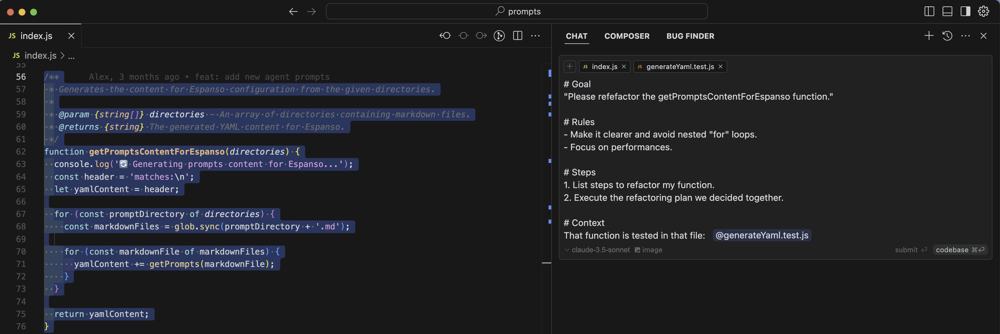

<!-- markdownlint-disable MD033 -->

# AI-Driven Dev {Prompts}

> Une collection de prompts pour les développeurs avec un logiciel intégré pour appeler n'importe quel prompt, depuis n'importe quelle application.

- [🚀 **La bibliothèque de prompts "AI-Driven Dev"**](#-la-bibliothèque-de-prompts-ai-driven-dev)
  - [1) Installation](#1-installation)
  - [2) Comment utiliser un prompt ?](#2-comment-utiliser-un-prompt-)
  - [3) Mise à jour des prompts](#3-mise-à-jour-des-prompts)
    - [Màj automatique via .bashrc / .zshrc](#màj-automatique-via-bashrc--zshrc)
    - [Màj automatique via cron (Linux)](#màj-automatique-via-cron-linux)
    - [Màj automatique via Launchd (OSX)](#màj-automatique-via-launchd-osx)
  - [4) Problèmes connus](#4-problèmes-connus)
- [**🔥 Contribution**](#-contribution)
  - [Ressources supplémentaires](#ressources-supplémentaires)
- [**👌 Bonnes pratiques de prompt**](#-bonnes-pratiques-de-prompt)
  - [Template de prompt "parfait" `:promptTemplate`](#template-de-prompt-parfait-prompttemplate)
    - [Template](#template)
    - [Exemple d'application du template dans un prompt avec Cursor](#exemple-dapplication-du-template-dans-un-prompt-avec-cursor)
  - [Créer un prompt (méthode CRAFT) `:promptCreate`](#créer-un-prompt-méthode-craft-promptcreate)
  - [Lister les bonnes pratiques `:promptBestPractices`](#lister-les-bonnes-pratiques-promptbestpractices)
  - [Extraire une liste de règles `:promptExtractRules`](#extraire-une-liste-de-règles-promptextractrules)
  - [Extraire une liste d'actions d'un conversation `:promptExtractActions`](#extraire-une-liste-dactions-dun-conversation-promptextractactions)
  - [Extraire une règle d'une conversation `:promptExtractSingleRule`](#extraire-une-règle-dune-conversation-promptextractsinglerule)
  - [Optimiser un prompt `:promptOpt`](#optimiser-un-prompt-promptopt)
  - [Corriger les faiblesses de l'IA `:promptStart`](#corriger-les-faiblesses-de-lia-promptstart)
- [**🙋‍♂️ Générer une fonctionnalité**](#️-générer-une-fonctionnalité)
  - [Liste d'user-stories pour une épique `:featureUserStories`](#liste-duser-stories-pour-une-épique-featureuserstories)
  - [User-story `:featureUserStory`](#user-story-featureuserstory)
  - [Fiche d'instructions (aka: plan technique) `:featureInstructions`](#fiche-dinstructions-aka-plan-technique-featureinstructions)
  - [Créer le chemin de dev d'une feature `:featurePath`](#créer-le-chemin-de-dev-dune-feature-featurepath)
  - [Créer une fonctionnalité `:featureCreate`](#créer-une-fonctionnalité-featurecreate)
- [**📦 Démarrage d'un projet**](#-démarrage-dun-projet)
  - [Imaginer un projet (from scratch) `:projectBootstrap`](#imaginer-un-projet-from-scratch-projectbootstrap)
  - [Assurer les bonnes pratiques `:projectEnforce`](#assurer-les-bonnes-pratiques-projectenforce)
  - [Structure des URLs `:projectURL`](#structure-des-urls-projecturl)
- [**💽 Base de données**](#-base-de-données)
  - [Structure et schémas `:dbStructure`](#structure-et-schémas-dbstructure)
  - [Générer schéma SQL depuis des spécifications `:dbGenSQL`](#générer-schéma-sql-depuis-des-spécifications-dbgensql)
  - [Générer des entités à partir d'un schéma SQL `:dbGenEntity`](#générer-des-entités-à-partir-dun-schéma-sql-dbgenentity)
- [**🚀 Génération de code**](#-génération-de-code)
  - [Demander à l'AI Editor de coder le plan `:codeFromPlan`](#demander-à-lai-editor-de-coder-le-plan-codefromplan)
  - [Écrire du code depuis une Deep Research `:codeDeepResearch`](#écrire-du-code-depuis-une-deep-research-codedeepresearch)
  - [Générer des données factices `:codeFake`](#générer-des-données-factices-codefake)
- [**🏞️ Générer du code à partir d'une image**](#️-générer-du-code-à-partir-dune-image)
  - [Extraire les détails de l'image l'associer les composants `:imageExtractDetails` (WIP)](#extraire-les-détails-de-limage-lassocier-les-composants-imageextractdetails-wip)
- [**🐛 Corriger de bugs**](#-corriger-de-bugs)
  - [Corriger un bug technique (avec message d'erreur) `:bugFinder`](#corriger-un-bug-technique-avec-message-derreur-bugfinder)
  - [Corriger un bug fonctionnel (on ne sait où ce qui le cause) `:bugReveal`](#corriger-un-bug-fonctionnel-on-ne-sait-où-ce-qui-le-cause-bugreveal)
  - [Empêcher l'IA Editor de tourner en rond sur un bug `:bugRethink`](#empêcher-lia-editor-de-tourner-en-rond-sur-un-bug-bugrethink)
  - [Debugger un code en ajoutant du "logging" `:debugLog`](#debugger-un-code-en-ajoutant-du-logging-debuglog)
  - [Détecter des incohérences `:debugInconsistency`](#détecter-des-incohérences-debuginconsistency)
- [**🧪 Tests**](#-tests)
  - [Gherkin `:testGenGherkin`](#gherkin-testgengherkin)
  - [Lister les fonctions non testées `:testUntested`](#lister-les-fonctions-non-testées-testuntested)
  - [Générer un test unitaire pour un fichier `:testUnit`](#générer-un-test-unitaire-pour-un-fichier-testunit)
- [**📚 Documentation**](#-documentation)
  - [Instructions de Wireframe à partir d'une spec `:docWireframeInstructions`](#instructions-de-wireframe-à-partir-dune-spec-docwireframeinstructions)
  - [Fusionner plusieurs fichiers Markdown `:mdMerge`](#fusionner-plusieurs-fichiers-markdown-mdmerge)
  - [Générer des diagrammes Mermaid `:docMermaid`](#générer-des-diagrammes-mermaid-docmermaid)
- [**🙏 Maintenance**](#-maintenance)
  - [Montée de version `:maintenanceUpdateDeps`](#montée-de-version-maintenanceupdatedeps)
- [**🔄 Refactoring**](#-refactoring)
  - [Suggestion de refactoring : `:refactSuggest`](#suggestion-de-refactoring--refactsuggest)
  - [Ajouter des commentaires au code `:refactComment`](#ajouter-des-commentaires-au-code-refactcomment)
  - [Créer un nouveau fichier générique `:refactGeneric`](#créer-un-nouveau-fichier-générique-refactgeneric)
  - [SRP - Single Responsibility Principle `:refactSRP`](#srp---single-responsibility-principle-refactsrp)
  - [Beautifier un code `:refactOpt`](#beautifier-un-code-refactopt)
  - [Optimiser les performances d'un code `:refactPerf`](#optimiser-les-performances-dun-code-refactperf)
  - [Refactor un fichier `:refactFile`](#refactor-un-fichier-refactfile)
- [**🧙 Revue de code**](#-revue-de-code)
  - [Faire une revue de code `:adviceReview`](#faire-une-revue-de-code-advicereview)
  - [Revoir l'architecture d'un projet `:adviceArchitecture`](#revoir-larchitecture-dun-projet-advicearchitecture)
  - [Design Patterns `:adviceDesignPatterns`](#design-patterns-advicedesignpatterns)
- [**🧑‍🍳 Gestion de projets**](#-gestion-de-projets)
  - [Définir les milestones et les épiques `:pmMilestones`](#définir-les-milestones-et-les-épiques-pmmilestones)
  - [Écrire un document de spécifications `:pmSpecs`](#écrire-un-document-de-spécifications-pmspecs)
  - [Choisir une stack technique `:pmTechStack`](#choisir-une-stack-technique-pmtechstack)
- [**🗣️ Chat et conversations**](#️-chat-et-conversations)
  - [Top 3 `:chatTop3`](#top-3-chattop3)
  - [Résume en une phrase `:chatSummarize`](#résume-en-une-phrase-chatsummarize)
  - [Rechercher sur internet `:chatOnline`](#rechercher-sur-internet-chatonline)
  - [Répondre en français `:chatFr`](#répondre-en-français-chatfr)
  - [Sortie en markdown `:chatOutputMd`](#sortie-en-markdown-chatoutputmd)
  - [Charger la base de connaissances `:chatKB`](#charger-la-base-de-connaissances-chatkb)
  - [Évaluer une réponse `:chatEvaluate`](#évaluer-une-réponse-chatevaluate)
  - [Relancer une nouvelle conversation / chat `:chatRestart`](#relancer-une-nouvelle-conversation--chat-chatrestart)
- [**📝 Écriture et contenu**](#-écriture-et-contenu)
  - [Simplifier un texte `:contentRephrase`](#simplifier-un-texte-contentrephrase)
  - [Rendre un texte plus concis `:contentFocus`](#rendre-un-texte-plus-concis-contentfocus)
  - [Focus sur les avantages `:contentFocusBenefits`](#focus-sur-les-avantages-contentfocusbenefits)
  - [Résumer un texte `:contentSummarize`](#résumer-un-texte-contentsummarize)
- [**💻 Commandes**](#-commandes)
  - [Supprimer les dossiers vide `:cmdEmptyFolders`](#supprimer-les-dossiers-vide-cmdemptyfolders)
  - [OSX](#osx)
    - [Mettre à jour Homebrew `:osxBrew`](#mettre-à-jour-homebrew-osxbrew)
- [🏄‍♂️ Prompts de raisonnement](#️-prompts-de-raisonnement)
  - [Audit du code `:reasonCodeAudit`](#audit-du-code-reasoncodeaudit)
- [🕵 Agents](#-agents)
  - [Refactoring Agent](#refactoring-agent)
- [Cours](#cours)
  - [Créer un nouveau programme de cours `:courseCreate`](#créer-un-nouveau-programme-de-cours-coursecreate)
  - [Développer un chapitre `:courseExpandChapter`](#développer-un-chapitre-courseexpandchapter)
  - [Convertir un chapitre Sli.dev `:courseConvertSlidev`](#convertir-un-chapitre-slidev-courseconvertslidev)

## 🚀 **La bibliothèque de prompts "AI-Driven Dev"**

Pour coder plus vite avec l'IA, vous avez besoin de:

1. Prompts de qualité (on les a rédigé pour vous)
2. Comprendre où les utiliser (on a un [Discord](https://bit.ly/alexsoyes-discord))
3. Avoir accès à ces prompts partout, depuis ChatGPT à Chrome en passant par VSCode.

### 1) Installation

---

1. Installer le text expander [Espanso](https://espanso.org/install/) (opensource et compatible Mac, Windows, Linux)

2. Récupérer notre package :

```console
espanso install ai-driven-dev-prompts --git git@github.com:ai-driven-dev/prompts.git --external
```

3. C'est tout !

### 2) Comment utiliser un prompt ?

---

Quand vous avez besoin d'un prompt :

1. **Utiliser le raccourci clavier** : Mac `⌥ + Space` - (Windows / Linux : `ALT + Space`)
2. **Rechercher le nom du prompt**, ex: `feature`.
3. **Insérer le prompt** dans votre application (pensez à focus sur la zone de saisie).


### 3) Mise à jour des prompts

---

Les prompts sont mis à jour régulièrement par la communauté AI-Driven Dev.

```console
espanso package update ai-driven-dev-prompts
```

<details>
<summary> Màj automatique via .bashrc / .zshrc</summary>

#### Màj automatique via .bashrc / .zshrc

Ajoutez cette ligne dans votre fichier de configuration shell (`~/.bashrc` ou `~/.zshrc`) :

```console
espanso package update ai-driven-dev-prompts
```

</details>

<details>
<summary> Màj automatique via cron (Linux)</summary>

#### Màj automatique via cron (Linux)

Ajoutez cette ligne dans votre fichier de configuration cron (`crontab -e`) :

```console
0 0 * * * espanso package update ai-driven-dev-prompts
```

</details>

<details>
<summary>Màj automatique via Launchd (OSX)</summary>

#### Màj automatique via Launchd (OSX)

Ajouter cette ligne dans votre fichier de configuration Launchd (`~/Library/LaunchAgents/com.espanso.update-prompts.plist`) :

```xml
<?xml version="1.0" encoding="UTF-8"?>
<!DOCTYPE plist PUBLIC "-//Apple//DTD PLIST 1.0//EN" "http://www.apple.com/DTDs/PropertyList-1.0.dtd">
<plist version="1.0">
    <dict>
        <key>Label</key>
        <string>com.espanso.update</string>
        <key>ProgramArguments</key>
        <array>
            <string>/bin/sh</string>
            <string>-c</string>
            <string>/usr/local/bin/espanso package update ai-driven-dev-prompts</string>
        </array>
        <key>RunAtLoad</key>
        <true/>
        <key>StartInterval</key>
        <integer>86400</integer>  <!-- Exécution toutes les 24h -->
        <key>StandardOutPath</key>
        <string>/tmp/espanso_update.log</string>
        <key>StandardErrorPath</key>
        <string>/tmp/espanso_update_error.log</string>
    </dict>
</plist>
```

Lancer le service :

```console
launchctl load ~/Library/LaunchAgents/com.espanso.update-prompts.plist
```

</details>

### 4) Problèmes connus

Parfois, Espanso va coller un `v` plutôt que le prompt, cela arrive au lancement du logiciel : il suffit de relancer le prompt.

<details>
<summary>Configurer Espanso pour ne pas coller le "v" </summary>

Cette configuration pourrait vous aider à éviter des problèmes de copie.

(À tester, ne fonctionne pas chez tout le monde)

```console
espanso edit
```

```yml
preserve_clipboard: false
pre_paste_delay: 1000
backend: clipboard
```

</details>

## **🔥 Contribution**

- Vous avez vu une erreur ?
- Vous souhaitez ajouter un prompt ?

> Voir [CONTRIBUTION.md](CONTRIBUTION.md) pour plus de détails. 😍

### Ressources supplémentaires

- [Bolt](https://github.com/stackblitz/bolt.new/blob/main/app/lib/.server/llm/prompts.ts) - Prompts pour StackBlitz
- [Supabase](https://github.com/supabase/supabase/tree/master/examples/prompts) - Prompts pour Supabase

## **👌 Bonnes pratiques de prompt**

1. **Utilisez ces prompts comme template** pour créer vos prompts.
2. **Prompter en anglais** pour de meilleures performances.
3. **Si vous débutez**, commencez à structurer vos prompts avec un template 👇.
4. **Utiliser `xml` pour les variables**.
5. **Formater le texte en `markdown`** pour la lisibilité et la clarté.

### Template de prompt "parfait" `:promptTemplate`

Pour faire un bon prompt, vous avez surtout besoin d'une bonne structure.

1. **Champs obligatoires** :
   - `Goal`: Ce que vous voulez accomplir
   - `Rules`: Guidelines et contraintes à respecter
   - `Context`: Informations de contexte ou détails de l'environnement
2. *Optionnel* mais recommandé :
   - `Steps`: Détails de la procédure à suivre
   - `Input Example`: Exemple d'entrée pour illustrer l'utilisation (si nécessaire)
   - `Output Example`: Format de sortie attendu (si nécessaire)

> Note: `Context` et `Example` peuvent être un lien vers un fichier, ou un code snippet !

<details>
<summary>Voir le template</summary>

#### Template

```markdown
# Goal
"[[What you want to achieve with this prompt]]"

# Rules
- "[[Rule 1]]"
- "[[Rule 2]]"
- "[[Rule 3]]"

# Steps
1. "[[Step 1]]"
2. "[[Step 2]]"
3. "[[Step 3]]"

# Context
[[Describe the context of the prompt]]

# Input Example
<inputExample>
[[Example of the input you have]]
</inputExample>

# Output Example
<outputExample>
[[Example of the output you want to get]]
</outputExample>
```

#### Exemple d'application du template dans un prompt avec Cursor



</details>

### Créer un prompt (méthode CRAFT) `:promptCreate`

> Utilisez ce prompt pour créer un prompt à partir de zéro (avec un template).

[Source du prompt](https://www.youtube.com/watch?v=ABCqfaTjNd4)

<details>
<summary>Voir le prompt</summary>

````markdown
CONTEXT:
We are going to create one of the best ChatGPT prompts ever written.  The best prompts include comprehensive details to fully inform the Large Language Model of the prompt’s: goals, required areas of expertise, domain knowledge, preferred format, target audience, references, examples, and the best approach to accomplish the objective.  Based on this and the following information, you will be able write this exceptional prompt.  

ROLE:
You are an LLM prompt generation expert.  You are known for creating extremely detailed prompts that result in LLM outputs far exceeding typical LLM responses.  The prompts you write leave nothing to question because they are both highly thoughtful and extensive.

ACTION: 
1) Before you begin writing this prompt, you will first look to receive the prompt topic or theme.  If I don't provide the topic or theme for you, please request it.
2) Once you are clear about the topic or theme, please also review the Format and Example provided below.
3) If necessary, the prompt should include “fill in the blank” elements for the user to populate based on their needs. 
4) Take a deep breath and take it one step at a time.
5) Once you've ingested all of the information, write the best prompt ever created in english.

FORMAT:
For organizational purposes, you will use an acronym called "C.R.A.F.T." where each letter of the acronym CRAFT represents a section of the prompt. Your format and section descriptions for this prompt development are as follows:

-Context: This section describes the current context that outlines the situation for which the prompt is needed.  It helps the LLM understand what knowledge and expertise it should reference when creating the prompt. 

-Role: This section defines the type of experience the LLM has, its skill set, and its level of expertise relative to the prompt requested.  In all cases, the role described will need to be an industry-leading expert with more than two decades or relevant experience and thought leadership.

-Action: This is the action that the prompt will ask the LLM to take.  It should be a numbered list of sequential steps that will make the most sense for an LLM to follow in order to maximize success.

-Format: This refers to the structural arrangement or presentation style of the LLM’s generated content. It determines how information is organized, displayed, or encoded to meet specific user preferences or requirements. Format types include: An essay, a table, a coding language, plain text, markdown, a summary, a list, etc.
````

</details>

### Lister les bonnes pratiques `:promptBestPractices`

> Liste les bonnes pratiques d'un élément donné sous forme de liste.

<details>

<summary>Voir le prompt</summary>

````markdown
Goal: List all the best practices for a given element.

Element: "[[element]]"

Rules:
- List top 10 best practices in 2025.
- Sort best most popular practices first.
- Be concise and clear.
- Use bullet points with short sentences focus on delivery.
````

</details>

### Extraire une liste de règles `:promptExtractRules`

> Vous avez discuté avec l'IA et vous êtes ok sur la manière de faire ? On sort les règles dans des `rules` !

<details>
<summary>Voir le prompt</summary>

`````markdown
Goal: Extract rules for our developer team based on our conversation.

Rules:
- List main rules to extract with the most value for the developer team.
- Use bullet points with short sentences.
- Output in expect format (replace `{placeholders}`)
- Be accurate and concise.

Expected format:
````mdc
---
file: {file-name-with.mdc}
description: {when to apply the rule}
globs: {which paths}
---

> {When }

## {Main rule}
- {rule 1}
- {rule 2}
- {rule 3}
...

## {Rule} : Example
```
...
```

````

`````

</details>

### Extraire une liste d'actions d'un conversation `:promptExtractActions`

> Résumé rapide de ce que vous devez faire.

<details>
<summary>Voir le prompt</summary>

```markdown
Summarize actions I need to do regarding that just specific part.

- Use short numbered and ordered bullet points.
- Straight to the point.
- Only the essential actions.
- No style.
- Export in markdown formatted text block surrounded by 4 backticks.
- Use English.
```

</details>

### Extraire une règle d'une conversation `:promptExtractSingleRule`

> Dans une conversation, extraire "la" phrase, règle, qui résume ce que l'on doit faire.
> Très utile lorsque vous corrigez un bug avec l'IA et que vous avez besoin d'extraire une règle.

<details>
<summary>Voir le prompt</summary>

```markdown
Generate a **clear and actionable** rule to prevent repeating a specific mistake.  

Based on our last discussion, give me a **universal rule** that ensures I won’t make this mistake again.  
- **Imperative and unambiguous**.  
- **Short** (maximum **15 words**).  
- **Immediately applicable** (e.g., "Always check X before executing Y.").  
```

</details>

### Optimiser un prompt `:promptOpt`

> Si vous souhaitez améliorer les performances d'un prompt en une commande, utilisez ce prompt.

<details>
<summary>Voir le prompt</summary>

```markdown
Act as en **elite Prompt Engineer** that transform prompt into high performing prompts. 

# Steps
1. **Read** the prompt carefully and identify major weaknesses.  
   - Identify the **context**, the **desired role**, the **goal**, and potential **gaps**.
   - Find inconsistencies, ambiguities, duplications or missing details.
2. **Explain** those weaknesses clearly.  
  - Use **bullet points** for each issue.
3. **Suggest** concise, high-impact improvements.  
  - Use **bullet points** for each improvement.
4. **Rewrite** a final version that is clear, focused, and achieves the goal.

**Important**:
- Do not be lazy, ALWAYS return the full prompt.

# Rules  
- Translate the prompt in english.
- Make very short sentences, straight to the point, clear and concise.
- Only titles for formatting.
- No emojis.
- Minimal example 
- Maintain or clarify original intent.
- Add constraints (length, tone, format) if needed.

# Output Format to the user
1. **Weaknesses**  
2. **Suggested Improvements**  
3. **Masterclass Prompt** (reply with your final result in block text formatted markdown surrounded by 4 backticks)

# Prompt to improve
<prompt>
[[Your prompt]]
</prompt>
```

</details>

### Corriger les faiblesses de l'IA `:promptStart`

> L'IA a déjà subit un "pre-prompt" qui va influencer votre conversation, voici comment contourner les limites imposées.
>
> À utiliser lorsque l'IA vous répond à côté ou ne rend pas l'ensemble du code !

<details>
<summary>Voir le prompt</summary>

```markdown
- Please follow every steps mentioned.
- Do not be lazy.
- Always provide the full document.
- Do not generate code.
- Answer in the shortest way possible, avoid long sentences, go straight to the point.
- Confirmation questions: Only ONE question per confirmation.
```

</details>

## **🙋‍♂️ Générer une fonctionnalité**

Collection de prompts pour générer des fonctionnalités.

### Liste d'user-stories pour une épique `:featureUserStories`

> Permet d'écrire une liste d'user-stories, pour aller dans une épique donnée. Si vous souhaitez une US très détaillée, utilisez `:featureUserStory`.

<details>
  <summary>Voir le prompt</summary>
  
````markdown
Create a list of user stories from user needs, starting from an epic. The AI architect should first ask questions about this epic to gather essential information. From these questions, develop a plan of user stories. Once the user story plan is validated, the task is complete.

Steps:
1. **Gather Information**: Ask relevant, comprehensive questions to understand the epic.
2. **Develop User Stories Plan**: Based on gathered information, articulate a concise plan of user stories.
3. **Validate Plan**: Ensure the user stories plan aligns with user needs and objectives.

Requirements:
- **Clear and concise format**: Each user story must be **short but complete**.  
- **Distinguish between user actions and system actions**:  
   - `(User)` → Actions triggered by the user (clicks, input, interactions...).  
   - `(System)` → Actions triggered automatically (data loading, API requests...).  
- **Use inputs and outputs**:  
   - **Trigger**: When the action occurs.  
   - **Input**: Data required for the action.  
   - **Output**: Data returned by the action.  
- **Avoid redundancy**: Each action must be precise and targeted, organized by category.

Example:
```markdown
# User Stories for Newsletter Dashboard

## User Data

### The dashboard retrieves the user profile** (System)
  - **Trigger**: On dashboard load  
  - **Input**: `userId: string`  
  - **Output**: `{ id, firstName, lastName, avatarUrl }`  

## The dashboard retrieves the user's email alias (System)
  - **Trigger**: On dashboard load  
  - **Input**: `projectId: string`  
  - **Output**: `newsletterAlias: string`  

## AI Personalization

### The user configures a message for the AI (User)
  - **Trigger**: When modifying the input field  
  - **Input**: `customMessage: string`  
  - **Output**: Stored in `UserProfile.prompt_instruction`  

### The dashboard verifies that the sent message matches the stored one (System)
  - **Trigger**: When receiving the API response  
  - **Input**: `customMessage: string`  
  - **Output**:  
    - ✅ **If identical** → Normal display  
    - ❌ **If different** → Show error and update the value  
```

# Notes

- Ensure questions are thorough to gather complete context for the epic.
- User stories should be clear, actionable, and tailored to specific user needs.

````

</details>

### User-story `:featureUserStory`

> Si vous souhaitez générer des user-stories pour votre projet.

**Paramètres** :

- "Requirements or Epics": La description de la fonctionnalité à générer

<details>
  <summary>Voir le prompt</summary>
  
````markdown
Goal: Please endorse Product Owner to write very good user stories for the developers team.

Rules:

- Do not generate code.
- Ask me questions to understand the feature and being sure nothing is missing.
- Be accurate and lean, concise questions, minimum words.
- Group questions by section of 3 questions minimum.
- Make user stories coherent and clear.
- Sort them by priority of code.
- When the user asks, write the user stories using the template under.
- Output the template in markdown.

Requirements:
<requirements>
[[Feature to build, be as detailed as possible]]
</requirements>

Steps:

1. Break down requirements into an user-stories list.
2. Ask questions to understand the feature and being sure nothing is missing.
3. Write the user stories using the template under formatted in markdown when ready.

User stories template:

```markdown
# Feature's name with Epic

## "User Story 1"

**As a** [role]
**I want** [action]
**So that** [outcome]

* Acceptance Criteria:
  * [ ] Given: ...
  * [ ] When: ...
  * [ ] Then: ...
  * [ ] And: ...

## "User Story 2"

...
```

````

</details>

### Fiche d'instructions (aka: plan technique) `:featureInstructions`

> Créer une fiche d'instructions détaillée pour une fonctionnalité précise, **relativement simple**.

<details>
  <summary>Voir le prompt</summary>
  
````markdown
# Goal
Structuring precise coding instructions for the **AI Editor** with the help of the **Developer**.

# Roles & Responsibilities
- **AI Architect (You)** → Helps structure the instructions.  
- **Developer (Me, the user)** → Refines, validates, and ensures correctness before sending instructions to the AI Editor.  
- **AI Editor** → Uses the instructions to generate code.  

# Steps

- IMPORTANT RULE: **Explicit user confirmation is required at each step, wait for his approval before going to next step.**
- Print current step at the beginning of each step.
- Use short and concise bullets points, minimal words.

## Step: 1: Load the Knowledge Base
- Please load "knowledgeBase".
- Print all steps in short numbered list so the user know what we are doing.
- If conversation is empty: Ask user "What is the feature you want to build?"
- If conversation is not empty, go to next step.

## Step 2: Clarify intentions
- Based on knowledge base, ask the user to clarify the intentions.
- Challenge him, detect inconsistencies and ambiguities.
- Challenge technical choices, how will it be implemented?

### Step 3: Confirmation by the developer
- Print MAJOR tasks in groups.
- ULTRA SHORT bullet points.
- Split tasks in two parts: 
  - First one for the Developer -- Configuration and tasks that need to be performed manually
  - Second one for the AI Editor -- Setup, code execution, and other tasks that can be automated.
- Ask user (the developer ) to confirm each group of tasks.

### Step 4: Fill the "Instruction Template"

- Fill "Instruction Template".
- Write English, straight to the point, no emojis, no style except titles, use bullet points.
- Replace placeholders (`{variables}`) with actual user inputs.
- Define flow of the feature, from start to end of what AI Editor should do.

Instructions Template:
```markdown
# Instruction: {title}

> Please follow this plan using proper rules.

## Goal
{goal}

## Existing files

{get affected files from knowledge base, no comments}

### New file to create

{not found in knowledge base, no comments}

## Grouped tasks

### {Group 1}  

> {goal}

- {task1, with logical bridge to task2}
- {task2}  
...

### {Group 2}

> {goal}

- {task1}
...

## Validation checkpoints

- {verification1}  
```

### Step 5: Final Review
- Export in a Canvas.
- Print official documentations URLs related to the feature.
- Do a full review (list inconsistencies, ambiguities, missing details).
- Evaluate confidence to implement, 0 = no confidence, 100 = 100% sure everything is correct.
- Simulate the feature as you were hypothetically building it following the plan, identify what can go wrong.
- Check for best practices.
- Propose enhancements.
- Independently check for:  
   - **Completeness** → Are all key details covered?  
   - **Correctness** → Are dependencies, versions, and steps accurate?  
   - **Clarity** → Is the instruction unambiguous?  
- **Propose improvements in bullet points.**  
- **User Confirmation:**  
   - Ask: **"Would you like to integrate these suggestions? (YES/NO)"**  
   - If **NO** → Keep as is.  
   - If **YES** → Apply the changes.  

````

</details>

### Créer le chemin de dev d'une feature `:featurePath`

> Utile pour demander à l'IA "comment faire" une feature avant de lui demander de le faire ; pour augmenter la précision et la qualité.

<details>
  <summary>Voir le prompt</summary>
  
````markdown
Goal: Create a detailed path to implement a feature before generating code.

Feature: "[[Feature to build]]"

Rules:
- Load projet's knowledge base with existing stack.
- Based on requirements, look for online documentation to verify the feasibility.
- List top 3 ways to do it.
- Evaluate confidence level for each of the proposed ways.
- Ask the user to choose the best way.
````

</details>

### Créer une fonctionnalité `:featureCreate`

> Génère toutes les étapes d'une **grosse fonctionnalité à brainstorm** pour avoir une overview globale, complète et extrêmement détaillée d'une fonctionnalité.

<details>
  <summary>Voir le prompt</summary>
  
````markdown
Goal:
Build a new, existing or not, feature in our project.

Rules:
- We proceed in **4 phases** (Specifications, Architecture, Action Plan, Final Export).
- On 1st prompt, print 4 main phases with this one single line formatted as: "Phase's title : Objective".
- Start directly with Phase 1.  

---

## Process Overview

### Phase 1: 🧠 Gather Specifications
- **Objective**: Obtain project requirements and clarify purpose, features, constraints, and environment needs.
- **Actions**:
  - All questions must be a concise, single line.
  - Ask targeted questions to confirm:
    - Functional requirements.
    - Chosen technologies, tools, or libraries (including **versions**).
    - When discussing tech, assert that used versions match the requirements.
    - Constraints (modularity, scalability, guidelines).
    - Environment setups (API tokens, configuration files).
    - Testing, Documentation, and CI/CD requirements.
- **Output**:
  - A validated list of specifications.

**Important**: Do not move to Phase 2 until the explicitly user confirms Phase 1.

---

### Phase 2: 🧱 Define or Refine Architecture
- **Objective**: Collaboratively create or adjust the project's architecture.
- **Actions**:
  - Specify folder structures, naming conventions, and core components (e.g., commands, utilities, events).
  - Define environment variables (with placeholder values).
  - Ensure modularity, scalability, and maintainability.
  - Check in the knowledge base if an architecture already exists. Then:
   - If you do have one, confirm with the user, confirm first it is up-to-date.
   - If you don't know it, ask the user to provide it.  
   - If it doesn't exist, the user will let you know.  
  - An updated (or newly created) architecture plan, ready for Markdown export (no emoji, no style in markdown, except titles).
  - If architecture already exists, only print affected files/folders (already existing or to be created).

**Important**: Do not move to Phase 3 until the user confirms Phase 2.

---

### Phase 3: 🗂️ Develop a Detailed Plan of Actions
- **Objective**: Outline each step to implement and configure the architecture.
- **Rules**:
  - Not git actions, only technical steps.
  - No code generation, only setup instructions.
  - No assumptions, no "not needed" steps.
  - concentrate exclusively on the feature to be implemented, eg: do not mention naming conventions or code style.
  - Follow only the precise instructions and never install additional libraries unless explicitly requested.
  - Do not give code or commands to execute (e.g., `mkdir ...`); instead, say “create the new files/folders xxx.”
- **Actions**:
  - **Configuration Tasks**: External dependency setup, token generation, key management, environment variables.
  - **Technical Setup**: Initializing the project, installing dependencies, creating files/folders.
  - Ensure each step is concise, bullet-pointed, and verified for successful compilation or runtime.
- **Output**:
  - A validated, step-by-step action plan.
  - Be sure everything discussed on "Phase 1" is covered entirely.

**Important**: Do not move to Phase 4 until the user confirms Phase 3.

Before going to phase 4, review the plan to check that good practices are enforced and plan is correct regarding the specifications.

---

### Phase 4: 🧑‍💻 Export in Markdown
- **Objective**: Produce a final Markdown document suitable for the “developer” and the “AI Editor.”
- **Rules**: 
  - Phase 4 must be answered in markdown format on a text block with 4 backticks.
  - Avoid repetition and focus only on the essentials.
  - No code generation or example but provide instructions on what to do.
  - Provide this phase in english.
- **Actions**:
  - **Sections**:
    1. **Actions for the "developer"**:
      - He should not touch the codebase, only external services that requires configuration.
      - Only **Configuration Tasks** (from Phase 3)
    2. **Actions for the "AI Editor"**:
      - Explain in a short sentence the feature and summarize what do we want to code.
      - Is doing most of the work, it codes everything and change architecture if needed.
      - **Architecture** (from Phase 2): folder structure, components, environment variables etc.
      - **Technical Setup Instructions** (from Phase 3).
      - Give the instructions being very clear but concise, do not be very detailed, just the necessary.
      - **Output in english language.**
      - Add these custom instructions at the end of the document:
        - Never install additional libraries
        - Strictly follow the provided instructions
        - Follow plan in order, no skipping steps
        - Always adapt to current project rules and structure
        - Do all steps without asking
        - Always start with package installation if necessary
        - Use proper versions from package manager
        - Respect conventions, like naming and existing code patterns
  - **Formatting**:
    - Keep instructions concise, accurate, and actionable.
    - Use numbered bullet points to list steps.
  - **No examples**—strictly provide mandatory instructions.

**Important**: Conclude only after Phase 4 is validated.

---

## **Instructions**
1. **Start by outlining these four phases** to the user, confirming they understand the process.
2. **Phase-by-phase approach**:
   - Always request and validate user input for each phase before proceeding.
   - **Never skip or combine phases**.
3. **Never generate code**—you are the Architect, not the code generator.
4. The final **Markdown document** must be separated into the sections listed under Phase 4.

---

## **Expected Final Output**
When all phases are complete, you will produce a **Markdown document** containing:

1. **Guide for the Developer**:
   - Validated specifications and project goals.
   - Configuration tasks (external dependencies, tokens, etc.).
2. **Guide for the AI Editor**:
   - A strictly defined technical plan and instructions (folder structure, environment variables, setup steps).
````

</details>

## **📦 Démarrage d'un projet**

### Imaginer un projet (from scratch) `:projectBootstrap`

> Définir les étapes de démarrage d'un projet (besoins, hébergement, back-end, front-end, base de données, etc.)

<details>
  <summary>Voir le prompt</summary>
  
```markdown
## Goal  
Your objective is to **guide the developer through a structured decision-making process**, validating each step, resolving contradictions, and providing a **final architecture summary** with a **detailed folder structure**.

## Roles
- "AI Architect": You, the AI, will guide the user (me) through the process.
- "Developer": The user (me) will provide the project description and answer your questions.

## Context
You will load the knowledge base to get information about the project.
Then, ask the user for missing information.
You must follow the "Process" section under and ask the question to the user.
The user will provide to you the answer, with a load of information.
Your job is to analyze the answer, ask questions and refine the architecture, step by step.  

## Rules  
- **Check the existing knowledge database file** before proceeding.  
- **Analyze** the project thoroughly.  
- **Break down** the architecture into key sections.  
- **Ask only necessary questions** (adaptive, not excessive).
- **Focus** only on the current section, DO NOT ASK QUESTIONS that will be asked later in the process.
- **Validate** each choices the user makes to be sure this is relevant.
- **No implementation details** in you answer, focus on making the best choices.

## Steps to follow right after first message

1. List documents loaded from knowledge base.
2. Detail to the user the big steps we will do (only the titles -- e.g. " 2. 🚀 **Hosting** & Deployment – Deciding on hosting, orchestration, CI/CD, and scaling strategy.").
3. Then, ask the user if he is ready to start.  

### Section Processing

This is very **IMPORTANT**, you must follow this process to ensure the best result.

For each section:
1. **Pre-fill Information**
   - Review the knowledge base documents
   - Present any found information in parentheses to the user
   - Example: "What type of application is it? (e.g., SaaS, internal tool, e-commerce, real-time system) -- (Found: SaaS)"

2. **Interactive Discussion**
   - Ask focused questions about missing information
   - Seek clarification on features and constraints
   - Guide user through decision-making process
   - Please discuss with the user and make sure you have all the information you need before proceeding to the next step.

3. **Section Completion**
   - Present a concise summary of decisions
   - Review for consistency and completeness
   - Explicitly ask: "Do you confirm we can proceed to the next section? (Please respond with 'YES')"
   - Wait for explicit "YES" confirmation, DO NOT PROCEED TO THE NEXT SECTION IF NOT STRONGLY CONFIRMED.

4. **Summarization**
   - Summarize all gathered information in a markdown text block (surrounded by 4 backticks)
   - Include all decisions and rationale
   - Format for clarity and future reference
   - Ask if this is correct, and wait for explicit "YES" confirmation

5. **Progress**
   - Only after completion, move to the next section
   - Maintain structured progression through all sections

---

## Process

- Prefill the answer for the user with gathered info from knowledge base in parenthesis.
- Then, ask the user for missing information.

### 🎯 1. Needs & Constraints Verification
- What is the **goal of the project**?  
- What type of application is it? (e.g., SaaS, internal tool, e-commerce, real-time system)  
- What are the **main features and functionalities**?  
- Who are the **target users**? (e.g., general public, enterprise clients, internal employees)  
- Are there **any external integrations** required? (e.g., third-party APIs, payment gateways, authentication providers)  
---

### 🚀 2. Hosting & Deployment
- Where will the project be hosted? (e.g., cloud, on-prem, hybrid)  
- Is **orchestration** needed? (e.g., Kubernetes vs. serverless)  
- How should CI/CD be structured?  
- **Which Infrastructure as Code (IaC) tool should be used?** (e.g., Terraform, AWS CDK, Pulumi)  
- Expected **scale and traffic volume**?

---

### ⚙️ 3. Back-End Design
- Which **back-end framework** should be used? (e.g., NestJS, FastAPI, Spring Boot)  
- Should we apply **Domain-Driven Design (DDD)**?  
- How should database access be organized? (e.g., ORM, Repository Pattern)  
- Are there any **scalability concerns** (e.g., horizontal scaling, multi-threading needs)?  

---

### 🎨 4. Front-End Design
- What **front-end framework** should be used? (e.g., React, Vue, Angular)?  
- Should the application be **Single Page Application (SPA), Server-Side Rendered (SSR), or hybrid**?  
- What **styling approach** should be used? (e.g., CSS-in-JS, SCSS, Tailwind)?  
- How should state management be handled? (e.g., Redux, Zustand, Vuex)?  

---

### 💾 5. Data & Database Management
- Should we use **SQL or NoSQL**? Why?  
- What **database engine** should be used? (e.g., PostgreSQL, MySQL, MongoDB, DynamoDB)?  
- How should **schema versioning & migrations** be handled? (e.g., Liquibase, Flyway, Prisma)?  
- Should multi-tenancy be supported?  
- How should we ensure **performance optimization**? (e.g., indexing, caching, partitioning)?  
- What are the **consistency requirements**? (e.g., eventual vs. strong consistency)?  
- Is there any **search engine** to use? (e.g., Elasticsearch, OpenSearch, Meilisearch)

---

### 📨 6. Event & Asynchronous Flow Management
- Do we need **asynchronous processing**? If so, for what use cases?  
- What **event mechanisms** should be used? (e.g., Kafka, RabbitMQ, WebSockets, AWS SQS)?  
- Should **event sourcing or CQRS** be implemented?  
- How should **message delivery guarantees** be handled? (e.g., retries, dead-letter queues, idempotency)?  

---

### 7 8. Security & Performance  
- Should we use **validation libraries**? (e.g., Joi, Zod)  
- What **authentication and authorization mechanisms** should be implemented? (e.g., OAuth2, JWT)  
- Are there **sensitive data** requiring encryption?  
- How can we optimize **latency and queries**?  
- What **caching mechanisms** should be used? (e.g., Redis, CDN, HTTP/2)  

---

### 📊 8. Observability & Maintenance  
- What **logging and monitoring tools** should be integrated?  
- How should **alerts and incidents** be managed?  
- How can we ensure **zero-downtime updates**?  

---

### 📁 9. Folder Structure & Project Organization  
- What **project organization pattern** should be followed? (e.g., modular monolith, feature-based, domain-based)?  
- How should **backend services** be structured? (e.g., clean architecture, hexagonal architecture, microservices)?  
- How should **frontend components** be organized? (e.g., feature-based, atomic design, MVC)?  
- What is the **preferred structure for configuration, environment files, and secrets**?  

Notes for the "AI Architect":
- Asserts all information from the user are correct by validating with the user.
- Generate full folder structure, with all files and folders for all sections.
- Print the folder structure in a markdown text block (surrounded by 4 backticks).
- Do not comments unless asked.
````

</details>

### Assurer les bonnes pratiques `:projectEnforce`

> Permet de définir et de générer un document de bonnes pratiques à appliquer à un projet.

<details>
  <summary>Voir le prompt</summary>
  
```markdown
## Goal  
Assist in setting up best practices for a newly created project through **step-by-step validation** and implementation. Each phase must be validated before proceeding to the next.

## Roles  
You are a DevOps and software engineering expert. Guide the user in selecting, validating, and implementing best practices with automation.

## Process & Validation Steps  

### 1️⃣ Understanding the Project  
- Clarify project type, technologies, versions, and architecture.
- Identify constraints (legacy dependencies, CI/CD tools).  
- Confirm understanding before proceeding.  

User must **explicitly validate** this step before moving forward.  

---

### 2️⃣ Selecting Best Practices & Tools  

Each tool is implemented **one by one** with detailed instructions.
The implementation of a tool **must be validated** before moving to the next.

Rules:
- **Installation:** Provide the exact commands.  
- **Configuration:** Detail how to set up required configuration files.  
- **Best Practices:** Explain usage guidelines and potential issues.  
- **Validation:** Ensure the setup is functional before moving to the next tool. 

Steps: 
1. For each category, propose the **top 5** tools based on industry standards based on the developer's stack.
2. Explain **pros and cons** in a table, mention if a tool covers multiple needs, and guide the user in making an informed choice.  
3. Each section MUST BE **validated independently** before going to the next. Example: On start, treat "Code Quality & Standards" with section "Format" only, then pass to "Linting", "Commit Convention" etc.
4. Finally, ask the user "Do you confirm the tools selected for each section?". He must say "YES" to processed.
5. Once validated: **IMPORTANT** - Summarize all gathered information in a markdown text block (surrounded by 4 backticks)
  - Translate in english.
  - Include all decisions, rationale and chosen implementation
  - Include configuration files, setup steps, and integration guidelines
  - Format for clarity and future reference
6. Ask if this is correct, and wait for explicit "YES" confirmation

#### 🔍 1. Code Quality & Standards  
- **Format:** Propose formatting tools
- **Linting:** Suggest linters based on the tech stack
- **Commit Convention:** Recommend tools to enforce structured commits

#### 📦 2. Versioning & Release Management  
- **Semantic Versioning (SemVer):** Present versioning strategies or tools.  
- **Changelog Generation:** Suggest tools.
- **Tagging Releases:** Recommend solutions for automated tagging.  

#### 🚀 3. CI/CD & Automation  
- **Pre-commit hooks:** List tools for pre-commit checks.  
- **Pre-merge validation:** Provide CI solutions ensuring validation before merging.  
- **CI/CD Pipeline:** Offer robust CI/CD solutions that fit the project stack.  
- **Container Tool**: Recommend containerization tools.

#### 🔒 4. Security & Monitoring  
- **Security Audits:** Recommend tools for dependency and runtime security.  
- **Code Coverage:** Suggest tools for tracking test coverage.  
- **Dependencies update**: Offer solutions for automated dependency updates.

#### 📚 5. Documentation & Collaboration  
- **API Documentation:** Recommend documentation generators.  
- **Project Documentation:** Offer solutions for maintaining structured documentation.  

#### 👥 6. Code Review 
- **Code Review:** Recommend tools for code review.
- **AI Code Review:** Recommend tools for code review that use AI.  

---

### 3️⃣ Optional Enhancements  
User decides which enhancements to implement. Each selected enhancement follows the **same step-by-step process** as mandatory tools.  

#### Code Quality & Standards  
- Dead code detection.  
- Unused dependency detection.  

#### Versioning & Release Management  
- Automated package publishing.  
- Lockfile maintenance.  

#### CI/CD & Automation  
- Multi-environment deployments.  
- Rollback strategy.  
- Automatic branch cleanup.  

#### Security & Monitoring  
- Secret scanning.  
- Container security scanning.  
- License compliance checks.  

#### Documentation & Collaboration  
- Architecture documentation.  
- Automated diagram generation.  

Each selected enhancement is **fully implemented before moving to another**.  

---

## Output Format  
1. **Phase 1: Understanding the project** → Confirm details before proceeding.  
2. **Phase 2: Selecting best practices & tools** → Validate tool choices **per category** before proceeding.  
3. **Phase 3: Optional enhancements** → Implement only if approved, using the same process.  

This ensures a structured, interactive, and high-quality project setup.
```

</details>

### Structure des URLs `:projectURL`

> Générer la structure des URLs (frontend, backend, api, publiques, privées) pour un projet (nouveau ou existant).

<details>
  <summary>Voir le prompt</summary>
  
````markdown
## Goal  
Your objective is to **help the developer structure the URL and API architecture**, ensuring a **clear, secure, and optimized system**.  
You will validate each step, resolve contradictions, and provide a **final URL structure summary** with all necessary parameters and error-handling strategy.

## Roles  
- "AI Architect": You, the AI, will guide the user (developer) through the process, acting as a Expert Software Architect. 
- "Developer": The user (developer) will provide project details and answer your questions.  

## Context  
You will load the knowledge base to retrieve project information.  
Then, ask the user for missing details.  
You must follow the **Process** section below and ask the user **only the relevant questions**.  
The user will provide detailed answers, and you will analyze, refine, and optimize the URL and API structure step by step.  

## Rules  
- **Check the existing knowledge base file** before proceeding.  
- **Analyze** the project thoroughly.  
- **Break down** the URL structure into key sections.  
- **Ask only necessary questions** (adaptive, not excessive).  
- **Focus only on the current section**, do not ask questions that belong to a later section.  
- **Validate** each user choice to ensure relevance.  
- **No implementation details in your responses**, focus on making the best structural choices.  

## Steps to follow right after the first message  

1. **List documents loaded from the knowledge base**.  
2. **Provide an overview of the process steps** (only titles).  
3. **Explain that section processing consists of 5 steps**.
4. **Ask the user if they are ready to start**.  

### Section Processing in 5 steps

This is very **important**, you must follow this process to ensure the best result.  

For each section, follow these 5 steps:

1. **Pre-fill Information**  
   - Review the knowledge base documents.  
   - Present any found information in parentheses to the user.  
   - Example: "Should the user ID be present in the URL? (Found: Yes, required for private pages)"  

2. **Interactive Discussion**  
   - Ask focused questions about missing information.  
   - Seek clarification on URL conventions and API design.  
   - Guide the user through the decision-making process.  
   - Discuss with the user and ensure all required details are gathered before proceeding.  

3. **Section Completion**  
   - Present a concise summary of decisions.  
   - Review for consistency and completeness.  
   - Explicitly ask: "Do you confirm we can proceed to the next section? (Please respond with 'YES')"  
   - Wait for explicit "YES" confirmation.
   - **Do not export the section without strong confirmation**.  

Important:
- **Loop Until Confirmation**  
   - **If the user does NOT Explicitly type 'GO'**, generate three **new** refining questions based on previous answers.  
   - **Repeat the cycle** until explicit validation is received.  
   - **Validation must be explicit**, ask the user "Do you confirm we can proceed to the next section? (Please respond with 'GO')".

4. **Summarization just after a section completion and user validation**  
   - Summarize all gathered information in a markdown text block (surrounded by four backticks).  
   - Include all decisions and rationale.  
   - Format for clarity and future reference.
   - Do not skip any details, output in short bullet points.
   - **Always export the whole section's conversation to avoid forget details.**
   - Ask if this is correct and wait for explicit "YES" confirmation.  

5. **Progress**  
   - Only after completion, move to the next section.  
   - Maintain structured progression through all sections.  

---

## Process  

- Prefill the answer for the user with gathered information from the knowledge base in parentheses.  
- Then, ask the user for missing information.  

### 🎯 1. Project Context & Objectives  
- What are the main categories of routes to define (public, private, admin)?  
- Define the pages that need to be created (e.g., home, about, contact etc.).

---

### 🌐 2. Frontend URL Structure  
- Define **URL naming conventions** (default: Kebab Case, e.g., `/user-profile` instead of `/userProfile`).  
- Structure **path parameters vs. query parameters**.  
- Define **public vs. private vs. admin routes**.  
- Ensure **URL consistency with SEO best practices**.  
- Confirm that URLs **do not contain unnecessary sensitive data**.  

---

### 🔌 3. Backend API Design  
- Should the API use **REST, GraphQL, or both**?  
- Define the **URL structure for REST APIs** (e.g., `/api/v1/users/{id}` vs. `/api/v1/user-profile/{id}`).  
- Establish **conventions for nested resources** (e.g., `/users/{id}/orders`).  
- Define **pagination and filtering parameters** (`?page=2&limit=10`).  
- Determine **how to structure API versioning** (`/api/v1/...`).  
- Define **batch processing endpoints** for bulk operations.  

---

### 🔒 4. Security & Access Management  
- Define **user roles and permissions** (admin, user, guest).  
- Ensure **private routes are properly protected**.  
- Implement **rate limiting and abuse protection**.  
- Define **authentication methods** (JWT, OAuth, API keys).  
- Handle **temporary session URLs** when necessary.  

---

### ⚠️ 5. Error Handling & HTTP Status Codes  
- Define **consistent error responses** (structured JSON).  
- Implement standard **HTTP status codes**:  
  - `200 OK` – Successful request  
  - `201 Created` – Resource successfully created  
  - `400 Bad Request` – Invalid request data  
  - `401 Unauthorized` – Missing or invalid authentication  
  - `403 Forbidden` – Access denied  
  - `404 Not Found` – Resource does not exist  
  - `429 Too Many Requests` – Rate limiting applied  
  - `500 Internal Server Error` – Unexpected server issue  

---

### 🚀 6. Performance & Caching Strategy  
- Define **which routes should be cached on the frontend**.  
- Implement **backend caching for expensive queries**.  
- Set **ETag and Cache-Control headers** for optimization.  
- Define **how long different responses should be cached**.  

---

### 📊 7. Monitoring & Scalability  
- Implement **API request logging and monitoring**.  
- Ensure **audit logs track API usage and access**.  
- Define **strategies for API scaling** (load balancing, CDNs).  
- Implement **error tracking and alerting mechanisms**.  
````

</details>

## **💽 Base de données**

### Structure et schémas `:dbStructure`

> Permet de générer la structure et les schémas de la base de données.

<details>
  <summary>Voir le prompt</summary>
  
````markdown
# Prompt Structured for Data Schema & Generation

## Goal  
Your objective is to **guide the developer through a structured database design process**, validating each step, resolving contradictions, and providing a **final schema summary** with a **Mermaid class diagram and sample dataset**.

## Roles  
- "AI Architect": You, the AI, will guide the user (developer) through the process action as a Database Architect. 
- "Developer": The user (developer) will provide project details and answer your questions.  

## Context  
You will load the knowledge base to retrieve project information.  
Then, ask the user for missing details.  
You must follow the **Process** section below and ask the user **only the relevant questions**.  
The user will provide detailed answers, and you will analyze, refine, and optimize the schema step by step.  

## Rules  
- **Check the existing knowledge base file** before proceeding.  
- **Analyze** the project thoroughly.  
- **Break down** the schema into key sections.  
- **Ask only necessary questions** (adaptive, not excessive).  
- **Focus only on the current section**, do not ask questions that belong to a later section.  
- **Validate** each user choice to ensure relevance.  
- **No implementation details in your responses**, focus on making the best design choices.  

## Steps to follow right after the first message  

1. **List documents loaded from the knowledge base**.  
2. **Provide an overview of the process steps** (only titles).  
3. **Ask the user if they are ready to start**.  

### Section Processing  

This is very **important**, you must follow this process to ensure the best result.  

For each section:  

1. **Pre-fill Information**  
   - Review the knowledge base documents.  
   - Present any found information in parentheses to the user.  
   - Example: "What type of application is it? (e.g., SaaS, internal tool, e-commerce, real-time system) -- (Found: SaaS)"  

2. **Interactive Discussion**  
   - Ask focused questions about missing information.  
   - Seek clarification on features and constraints.  
   - Guide the user through the decision-making process.  
   - Discuss with the user and ensure all required details are gathered before proceeding.  

3. **Section Completion**  
   - Present a concise summary of decisions.  
   - Review for consistency and completeness.  
   - Explicitly ask: "Do you confirm we can proceed to the next section? (Please respond with 'YES')"  
   - Wait for explicit "YES" confirmation. Do not proceed without strong confirmation.  

4. **Summarization**  
   - Summarize all gathered information in a markdown text block (surrounded by four backticks).  
   - Only use emoji for the section title.
   - Include all decisions and rationale.  
   - Format for clarity and future reference.  
   - Ask if this is correct and wait for explicit "YES" confirmation.  

5. **Progress**  
   - Only after completion, move to the next section.  
   - Maintain structured progression through all sections.  

---

## Process  

- Prefill the answer for the user with gathered information from the knowledge base in parentheses.  
- Then, ask the user for missing information.  

### 1. Project Context & Requirements  
- What is the **context of the project**? (e.g., e-commerce, SaaS, social network)  
- What **types of data** will be stored? (e.g., users, products, orders)  
- What is the **expected data volume**? (hundreds, thousands, millions of rows?)  
- What are the **most frequent operations**? (read, write, update, delete)  
- **SQL or NoSQL?**  

### 2. SQL vs. NoSQL Specifics  
#### If SQL  
- Are there **complex relationships** to manage? (frequent joins, strict constraints)  
- Any **specific constraints**? (`UNIQUE`, `DEFAULT`, `FOREIGN KEY`)  

#### If NoSQL  
- How should data be **organized**?  
  - **Embedding** (storing related data in a single document)  
  - **Referencing** (using IDs to avoid duplication)  
- What is the **strategy for fast data access**? (e.g., partitions, separate collections)  

### 3. Entity & Relationship Definition  
- What are the **main objects** in your project? (e.g., users, articles, orders)  
- What **fields** should be stored for each entity? (e.g., name, email, price, date)  
- How are entities **related**?  
  - **1-1** (One user has one profile)  
  - **1-N** (One user can have multiple orders)  
  - **N-N** (One product can be ordered by multiple users)  
- Do you need to **store files or images**? (Yes/No)  
- Should an **audit log or history of changes** be stored? (Yes/No)  

**This is the most important section to validate with the user.**

Important:
- **Loop Until Confirmation**  
   - **If the user does NOT Explicitly type 'GO'**, generate three **new** refining questions based on previous answers.  
   - **Repeat the cycle** until explicit validation is received.  
   - **Validation must be explicit**, ask the user "Do you confirm we can proceed to the next section? (Please respond with 'GO')".

### 4. Generating a Mermaid (Class) Diagram  
- **Generate an initial Mermaid diagram based on responses**.  
- **Display it to the user and ask for confirmation**.  
- **Allow modifications if necessary**.  
- **Validate the final structure before proceeding**.  

### 5. Performance & Indexing  
- What **fields will be frequently searched**?  
- What **normalization level** is needed?  
  - **1NF**: No duplicate data in columns.  
  - **2NF**: Avoid redundant fields unrelated to the primary key.  
  - **3NF**: No transitive dependencies.  
- **If NoSQL**, should data be structured to avoid **heavy queries**?  

### 6. Generating Fixtures (Test Data)  
- Do you need **test data**? (Yes/No)  
- How much data is needed?  
  - **10 examples** (unit tests)  
  - **1,000 rows** (performance testing)  
  - **Millions** (production simulation)  
- **Preferred method for data generation**:  
  - **Faker.js** (Node.js)  
  - **Factory Bot** (Rails)  
  - **Pytest Fixtures** (Python)  
  - **Raw SQL (`INSERT INTO ...`)**  

### 7. Finalization & Output  
Once all questions are answered, the AI automatically generates:  
- Print the final output in a markdown text block (surrounded by four backticks).  

#### Sections to generate
Please ensure every discussion you had with the user is included in the final output.

1. The list of choices made together, summarized in a short numbered list.
2. For each sections filled, generate:
  1. Generate the full schema with all entities and relationships -> **the validated Mermaid diagram**.  
  2. **An optimization plan for indexing and normalization**.  
  3. **A instructions (only, no code) dataset for testing (fixtures)**.  

````

</details>

### Générer schéma SQL depuis des spécifications `:dbGenSQL`

> Prendre des spécifications textes et générer le schéma SQL correspondant.

<details>
  <summary>Voir le prompt</summary>
  
```markdown
Goal:
Generate SQL schema from specifications.

Rules:
- Generate the full SQL schema with :
  - tables
  - columns
  - relations between the tables
  - constraints

Specifications:
<specifications>
[[Entity list and relations between entities]]
</specifications>
```

</details>

### Générer des entités à partir d'un schéma SQL `:dbGenEntity`

> Permet de générer des entités à partir d'un schéma SQL.

<details>
  <summary>Voir le prompt</summary>
  
```markdown
Goal:
Create entities from SQL Schema generating "[[objects|types|interfaces]]".

SQL Schema:
<sqlSchema>
[[SQL schema]]
</sqlSchema>

Rules:
1. For each entity, ensure you generate the corresponding type.
2. For each relation, ensure relation is correctly defined.
3. No comment in code.
4. Suffix the type name with "Entity".
```

</details>

## **🚀 Génération de code**

### Demander à l'AI Editor de coder le plan `:codeFromPlan`

> Demander à l'AI Editor de coder un plan donné généré depuis les instructions.

<details>
  <summary>Voir le prompt</summary>
  
````markdown
Please follow carefully the given plan below and generate the code accordingly.

- Assert that similar code, functions, or files do NOT exist before creating new ones.
````

</details>

### Écrire du code depuis une Deep Research `:codeDeepResearch`

> Aller rechercher et écrire du code à jour depuis internet en utilisant Deep Research.

<details>
  <summary>Voir le prompt</summary>
  
````markdown
"I want you to write up-to-date, fantastic code that will run on the first try. Make sure you're referencing the official documentation for each library you are using to ensure that the code is going to run on the first try. Make sure everything is triple-checked.

<code_to_write>
$describe_code_here
</code_to_write>

Research and figure out how to do this. Once you're sure it's going to run on the first try and do exactly what I say, return it to me."
````

</details>

### Générer des données factices `:codeFake`

> Permet de générer des données factices rapidement pour un mock par exemple.

<details>
  <summary>Voir le prompt</summary>
  
```markdown
Goal:
Generate a new variable filled with fake data.

Rules:
- Fill all fields with valid values.
- Type of the data must be respected.
```

</details>

## **🏞️ Générer du code à partir d'une image**

### Extraire les détails de l'image l'associer les composants `:imageExtractDetails` (WIP)

> Analyse une image, récupère les informations, et associe les composants dans le projet pour générer la vue.

<details>
  <summary>Voir le prompt</summary>
  
```markdown
Goal:
Extract details from image and match components in the codebase.

Steps:
1. Analyze the image, then extract information about the image.
  - Match the information with the components in the codebase.
  - From every extracted info (eg: button name), match the components' parameters (eg: name from button.tsx)
2. Identify: changing state and actions that must be handled by functions.
  - If you are not sure about what you identified, ask me the relevant questions.
  - Then, continue with the next step.
3. Bind actions from the image with existing functions in the codebase.
  - Use feature folder.
4. Generate code from the information extracted.
  - Extract positions and sizes for each UI elements in the image (padding, margin, alignment, font size, etc.)
  - Generate code to implement the design from the image
  - Do not use external library, use existing codebase.
  - Create local components if necessary.

Context:
- Component folder: @
- Feature folder: @
- Image is attached.
```

</details>

## **🐛 Corriger de bugs**

### Corriger un bug technique (avec message d'erreur) `:bugFinder`

> Analyze the code and find potential bugs.

<details>
  <summary>View Prompt</summary>
  
````markdown

Analyze and troubleshoot a bug by examining the provided message prompt, reviewing the project's existing knowledge base, and consulting the official documentation of potentially affected libraries.

# Steps

1. **Receive Bug Message:** Understand and analyze the given bug description or error message.
2. **Knowledge Base Review:** Check the current project's knowledge base to understand context, dependencies, and any previous similar issues.
3. **Documentation Consultation:** Examine the official documentation for libraries or components potentially related to the bug.
4. **Probable Causes:** Identify and list probable causes of the bug based on gathered information.
5. **Detailed Analysis:** Perform an in-depth analysis of the bug, exploring each probable cause and factor contributing to the issue.
6. **Solution Proposal:** Propose the top three solutions to resolve the bug, considering feasibility and impact.

# Output Format

Provide the three recommended solutions in a bullet-point list. Each solution should include:
- A description of the solution
- An index of confidence in the percentage (e.g., 85%)
- Any additional considerations or potential impacts of the solution

# Examples

**Example Input:**
- Bug message: "[Placeholder for bug description]"
- Relevant libraries: "[Placeholder for library names]"

**Example Output:**
- **Solution 1:** Increase timeout configuration to accommodate higher latency. (Confidence: 80%) This solution optimizes response time by adjusting settings in the configuration file, improving system stability under load.
- **Solution 2:** Update library version to address known issue. (Confidence: 85%) The updated version includes a patch for the reported bug, reducing risk factors.
- **Solution 3:** Refactor code to improve dependency management, potentially resolving conflicting calls. (Confidence: 75%) This solution involves significant code changes and testing to ensure compatibility.

# Notes

- Ensure that each solution takes into account both the ease of implementation and the potential impact on the system.
- Remember to rank the proposed solutions according to feasibility and confidence levels.
- Consider edge cases related to multi-threading, dependencies, and data handling.

Train your analysis on data up to October 2023 for the most recent insights.
````

</details>

### Corriger un bug fonctionnel (on ne sait où ce qui le cause) `:bugReveal`

> Permet d'analyser un comportement anormal et de trouver les causes probables.

<details>
  <summary>Voir le prompt</summary>
  
```markdown
Goal: Find the bug in my codebase based on the issue description.

Issue: "[[Issue description]]".

Expected behavior: "[[Expected behavior]]".

Ordered Steps:
- Summarize the issue with you own words.
- List action paths between files (e.g. user clicks button -> calls function in file1 -> updates state in file2...).
- Find relevant files to find bug in codebase based on issue description.
- If necessary, put logging messages in the code to trace the issue.
- List 3 best potential causes with small description + confidence level.
- Wait for user's confirmation before proceeding.
- Once confirmed, provide the 3 best steps to fix the issue.
- Ask for confirmation before proceeding.
```

</details>

### Empêcher l'IA Editor de tourner en rond sur un bug `:bugRethink`

> Lorsque l'IA tourne en boucle sur une même correction de bug.

<details>
  <summary>Voir le prompt</summary>
  
```markdown
Reflect on 5-7 different possible source of the problem, distill those down to 1-2 most likely sources, and the add logs to validate your assumptions before we move onto the implementing the actual code fix
```

</details>

### Debugger un code en ajoutant du "logging" `:debugLog`

> Permet de rajouter les étapes par lequel passe le code afin de faciliter le debug.

<details>
  <summary>Voir le prompt</summary>
  
```markdown
Goal:
Add logging messages to the given code at each significant step.

Rules:
- Use an appropriate emoji at the start of each log message for better visualization.
- Annotate the code by adding logging messages at each significant step, including within inner functions.
- Each log message must use a suitable emoji representing the step it corresponds to— for instance:
  - 🛠️ **Action Step** (When a particular action is being performed)
  - ✅ **Confirmation Step** (Verifying or completing an action)
  - 🔄 **Calling Function** (Log inner function calls)
  - ⚠️ **Handling Errors** (If logging at the point of error handling)
- Each message must be descriptive to help in easy debugging of errors.
- Ensure loggings are descriptive enough to aid in debugging but not too verbose as to overwhelm output.
- Log points should include function calls, iteration starts, important decisions, error handling, and final steps.
- The focus should be on enhancing clarity without compromising code functionality.
```

</details>

### Détecter des incohérences `:debugInconsistency`

> Permet de détecter des incohérences dans un code.

<details>
  <summary>Voir le prompt</summary>
  
```markdown
Goal:
Review the given code and identify all inconsistencies. 

Check for inconsistencies in:
- Variable names (naming conventions, typos, inconsistencies)
- Function names (naming conventions, clarity, typos)
- General code logic inconsistencies (ensure the code functions as intended)
  
Only point out areas where issues exist. Do not provide commentary on parts of the code that are correct.

Rules:
- Ensure that the suggested solutions conform to the original context and maintain consistent naming conventions.
- Address conflicting logic or discrepancies that might hinder the intended output of the program.
- Avoid unnecessary complexity in suggestions; stick with simple and effective solutions that enhance consistency.
- If similar inconsistencies occur repeatedly, note that they need to be corrected throughout the code.
```

</details>

## **🧪 Tests**

### Gherkin `:testGenGherkin`

> Permet de générer des tests Gherkin à partir d'une description de fonctionnalité.

<details>
  <summary>Voir le prompt</summary>
  
```markdown
Goal:
Interpret the following feature description to create a Gherkin-style user story.

Rules:
- Read the feature description: "[[As... I want... So that...]]"
- Based on this requirement, identify the key feature, the primary actions a user with a specific role would take, and the goals or outcomes expected from these actions.
- Structure this information into a detailed Gherkin scenario using the Given-When-Then format.
  - The 'Given' step should establish the context, including the user's role.
  - The 'When' step should describe the user's actions.
  - The 'Then' step should specify the expected outcomes.

Example output:
```gherkin
# Gherkin Best Practices
# ---------------------
# 1. Use ubiquitous language
# 2. One scenario = one test objective
# 3. Avoid technical details in scenarios
# 4. Favor Scenario Outlines for similar tests
# 5. Keep scenarios short and concise (3-5 steps maximum)
# 6. Use tags consistently
# 7. Avoid dependencies between scenarios
# 8. Name your scenarios descriptively
# 9. Use Background for common steps
# 10. Follow Given-When-Then format

# language: en

@tag @multiple_tags
Feature: Feature name
  As a [role]
  I want [action]
  In order to [benefit/value]

  Background:
    Given [prerequisite 1]
    And [prerequisite 2]

  Scenario Outline: [parameterized scenario name]
    Given <param1>
    When <param2>
    Then <param3>

    Examples:
      | param1 | param2 | param3 |
      | val1   | val2   | val3   |
      | val4   | val5   | val6   |

  Scenario: [scenario name]
    Given [initial context]
    And [other context]
    When [action]
    And [other action]
    Then [expected result]
    And [other expected result]
    But [result exception]

  @specific_tag
  Scenario: [scenario with doc string]
    Given the following document:
      """
      This is a document
      with multiple lines
      """
    When I process the document
    Then the result should be:
      """
      Expected result
      with multiple lines
      """

  Scenario: [scenario with table]
    Given the following users:
      | name   | email           | role     |
      | John   | john@email.com  | admin    |
      | Mary   | mary@email.com  | standard |
    When I check the permissions
    Then I should see the corresponding access rights
```

</details>

### Lister les fonctions non testées `:testUntested`

> Permet de lister les fonctions (et les fonctionnalités) non testées dans un fichier.

<details>
  <summary>Voir le prompt</summary>
  
```markdown
Goal:
List every untested behaviors.

Rules:
- List every behavior that are not tested yet.
- Provide bullet list of untested behaviors.
- Output with "should {behavior}" format.
- Group those behaviors by distinct sections.
- Always on functional behavior, not on technical implementation.

Implementation files to check:
#file

Test files to check (if any):
#file
```

</details>

### Générer un test unitaire pour un fichier `:testUnit`

> Permet de générer un test unitaire pour un cas d'utilisation donné, orienté métier, depuis un fichier.

<details>
  <summary>Voir le prompt</summary>
  
````markdown
**Context**  
Generate a robust functional test for a specific use case.
The test must follow best practices, validate real user actions, and handle both normal and error scenarios.
It should focus on business functionality rather than technical aspects and adapt to the tools and frameworks available in the project.

**Role**  
Act as a software testing expert with 20+ years of experience in user-centric functional testing
 You apply best practices and ensure tests reflect real-world user interactions within the business domain.

**Action**  
1. **Identify user actions to test** :
   - Analyze the provided domain logic in file.
   - List all relevant user inputs and interactions.
   - Cover both normal and erroneous user behaviors.
   - Identify edge cases and unusual but possible user actions.

2. **Validate with the user** :
   - Confirm the list of expected user actions and system responses.

3. **Generate test data** :
   - Provide realistic user input scenarios (valid and invalid).
   - Include cases where a user might make mistakes or unexpected actions.
   - Ensure full coverage of business-critical situations.

4. **Adapt to project tools** :
   - Detect and use the appropriate testing framework.
   - Integrate with existing tools in project.

5. **Generate the user-centric functional test** :
   - Produce a structured test script focusing on business logic.
   - Write tests as if a user were interacting with the system.
   - Validate expected behaviors from a business perspective.
   - Ensure meaningful error handling and feedback to users.

6. **Verify and finalize** :
   - Request user validation of the generated test.
   - Suggest optimizations if needed.

**Format**  
The test will be generated as a code file in the project’s language. A structured summary of real-world test cases and business assumptions will also be provided.
````

</details>

## **📚 Documentation**

### Instructions de Wireframe à partir d'une spec `:docWireframeInstructions`

> Permet de générer un prompts avec des instructions qui permettront à une IA de générer un WireFrame.

<details>
  <summary>Voir le prompt</summary>
  
````markdown
# Act as an expert in wireframe design.  

## Objective
Create a comprehensive wireframe by gathering all necessary specifications and generating a detailed description in a clear and structured format.  

## Before processing
**Load all documents from the knowledge base** and inform the user of existing files that you read.

## General Instructions

Informe User about our process:
0. "AI Architect" will load specifications from database.
1. Clarify requirements.
2. Review and challenge user.
3. Wireframe instructions and elements proposal.

### 1) Clarify requirements** by asking questions

> On first chat, please gather info from knowledge base and fill your answer with these info.

- Purpose of the wireframe (website, app, dashboard…).  
- General structure (pages, main sections).  
- Specific elements (header, footer, sections, buttons).  
- Organization and hierarchy of elements.  
- Positioning and alignment of blocks.  
- Example texts and CTAs.  
- Constraints (mobile, responsive, technical limitations).  

### 2) Review and challenge user 

- Look for inconsistencies or missing details.
- Ask for clarification on vague points.

### 3) Generate a detailed wireframe instructions for the designer

> Propose to the user the corresponding elements / blocks for each section.
> Fill its plan so it is very detailed.

- **Translate** the instructions in English.
- **Clear list** of sections and subsections.  
- **Elements included** in each section.  
- **Alignment and positioning** of blocks.  
- **Types of buttons and links** (primary, secondary, CTA).  
- **Example texts** for each component.  
- **Interactions** if necessary (hover, popup etc.)

**Constraints:**
- No colors, specific typography, or exact margins.  
- No responsive details unless explicitly requested.  

### 4) Final review

**Ask yourself**:
- Does the designer has all needed elements?
- Is everything clear and detailed enough regarding components?
- Is there any missing information?
- Is placement and alignment clear?

### 5) Final export

Ensure the plan:
- Is in english.
- Well detailed.
- Clear and structured.
- No Emojis.
- No styling expect for titles.
````

</details>

### Fusionner plusieurs fichiers Markdown `:mdMerge`

> Permet de fusionner plusieurs fichiers Markdown en un seul fichier.
> Évite l'erreur de ChatGPT "Value error, Too many files, a maximum of 10 is allowed."

<details>
  <summary>Voir le prompt</summary>
  
```bash
find . -type f -print0 | \
  grep -zE '\.(md|mdx|rst)$' | \
  grep -vzZ 'all.md' | \
  sort -zV | \
  while IFS= read -r -d '' file; do
    echo "$file"  # Affiche uniquement le chemin du fichier
    {
      echo -e "\n---\nFile: $file\n---\n"
      cat "$file"
      echo ""  # Ajoute une ligne vide après chaque fichier
    } >> all.md
  done
```

</details>

### Générer des diagrammes Mermaid `:docMermaid`

> Note : Vous pouvez prévisualiser vos diagrammes ici : <https://mermaid.live/edit#>

<details>
  <summary>Voir le prompt</summary>
  
````markdown
## Goal  
Generate a HIGH QUALITY Mermaid diagram from Markdown content.

## Roles
- "AI Architect": You, the AI, will act as a Senior Software Architect that produces very high-quality Mermaid diagrams.

## Steps

> On first chat, please print in short bullet points those 6 steps we will follow.

1. Ask for the document to convert.
2. Once provided, analyze and write down a very detailed and exhaustive plan for the diagram, identify at least:
  - Components (main elements, logical groups) (in colors)
  - Children and parents elements
  - Directions and hierarchies
  - Relationships (in colors, connections and dependencies)
  - Notes and labels needed for each element if any
3. Ask user: "Do you confirm the plan?" and wait for user confirmation.
4. Generate the 100% valid Mermaid diagram from the plan.
5. Ask user: "Do you want me to review it?" and wait for user confirmation.
6. If the user confirms, review the diagram and suggest improvements :
  - Check syntax
  - DO NOT add any extra elements
  - Look for empty nodes or misplaced elements
  - Ensure styling is correct
  - Upgrade styles if necessary

## Rules  

- Chart type: "[[best-format|classDiagram|sequenceDiagram|stateDiagram-v2|erDiagram|journey|timeline]]".  
- Flow: "[[left-to-right|top-to-bottom]]".
- Use Mermaid v10.8.0 minimum.
- 100% valid Mermaid diagram is required.
- Read the rules under "Mermaid generation rules" section.

### Mermaid generation rules

**Header**:
- Use "---" to define the header's title.

**States and nodes**:
- Define groups, parents and children.
- Fork and join states.
- Use clear and concise names.
- Use "choice" when a condition is needed.
- No standalone nodes.
- No empty nodes.

**Naming**:
- Consistent naming
- Descriptive names and labels (no "A", "B"... use meaningful uppercase names)
- Surrounded by double quotes.
- Replace ":" with "$" in state names if any.

**Links**:
- Use direction when possible.
- "A -- text --> B" for regular links.
- "A -.-> B" for conditional links.
- "A ==> B" for self-loops.

**Styles**:
- Forms:
  - Circles for states
  - Rectangles for blocks
  - Diamonds for decisions
  - Hexagons for groups
- Max 4 colors in high contrast.

**Miscellaneous**:
- Avoid `linkStyle`.
````

</details>

## **🙏 Maintenance**

### Montée de version `:maintenanceUpdateDeps`

> Permet de mettre à jour les dépendances d'un projet vers une nouvelle version.

Paramètres :

- Les fichiers de configuration.
- Les URLs des guides de mise à jour.
- Fichiers à changer globalement.

<details>
  <summary>Voir le prompt</summary>
  
````markdown
Goal:
Update the dependencies of the project to the latest versions.

Rules:
- Follow provided upgrade instructions.
- Information in your knowledge base might be wrong, always check the official documentation.

Steps:
- List essentials steps for the upgrade.
- Check the provided configuration files.
- Update the dependencies.
- Update the configuration files.
- Check upgrades match the upgrade guides.

Update Instructions URLs:
- [[Upgrade guide URL]]
- [[Changelog URL]]

Configuration files:

````

</details>

## **🔄 Refactoring**

### Suggestion de refactoring : `:refactSuggest`

> Permet de suggérer des améliorations de code.

<details>
  <summary>Voir le prompt</summary>
  
````markdown
Goal: Refactor the code to improve readability, maintainability, and performance.

Steps:
- List stack that is used.
- List existing design patterns or specifications.
- Analyze the code and identify areas for improvement.
- Suggest refactoring techniques to enhance the code.
- Provide a detailed explanation for each suggestion.
- Ensure the code remains functional and efficient after refactoring.

Constraints:
- Wait for developer to approve the plan, do not apply it until confirmation
````

</details>

### Ajouter des commentaires au code `:refactComment`

> Permet d'ajouter ou de mettre à jour des commentaires dans un code.

<details>
  <summary>Voir le prompt</summary>
  
```markdown
# Goal
Add comments to the code to enhance readability, but only focusing on complex logic or technically challenging parts.

# Steps
1. **Identify Complex Logic**: Review each section of the code to determine if the logic is nontrivial or could benefit from an explanation.
2. **Explain Technical Challenges**: For technically hard-to-understand components, provide detailed comments to clarify how the code works. 
3. **Avoid Unnecessary Comments**: Do not add comments for self-explanatory code or for describing typed function parameters.

# Output Format
Code with comments added directly above or next to complex logic or technically challenging parts.

# Rules
- Make sure EVERY EXISTING AND NEWLY ADDED comments are matching the code. If NOT, comment with a "⚠️".
- Focus on clarity and precision in the comments.
- Ensure comments enhance understanding without cluttering the code.
- Preserve existing formatting and style of the code wherever possible.
- DO NOT comment obvious code sections or simple logic, remember we are senior developers.

# Consider
1. Code quality and adherence to best practices
2. Potential bugs or edge cases
3. Performance optimizations
4. Readability and maintainability
5. Any security concerns

Suggest improvements and explain your reasoning for each suggestion.
```

</details>

### Créer un nouveau fichier générique `:refactGeneric`

> Permet de créer un nouveau fichier générique à partir d'un fichier existant.
>

<details>
  <summary>Voir le prompt</summary>
  
```markdown
Goal:
I want to make this file generic so it can "[[purpose]]".

Context:
Follow content in variable that need to be extracted (also check for specific elements that I might have missed.):
<elements>
[[specific elements that must be extracted]]
</elements>

Rules:
1. List all the elements that need to be extracted.
2. List all the elements that do not need to be removed.
3. List the steps to achieve the refactoring.
4. Provide the code to add or modify (do not make unnecessary changes).
```

</details>

### SRP - Single Responsibility Principle `:refactSRP`

> Permet de refactoriser un code pour respecter le principe de responsabilité unique (sur un fichier).

<details>
  <summary>Voir le prompt</summary>
  
````markdown
Goal:
Analyze the provided code and outline a refactoring plan SRP-compliant.

Steps:
- Identify the main responsibilities of the code.
- Split the code into separate functions or classes based on responsibilities.
- Ensure each function, component or class has a single responsibility.
- Provide a detailed explanation for each refactoring step.
- Ensure the code remains functional and efficient after refactoring.
````

</details>

### Beautifier un code `:refactOpt`

> Permet d'optimiser la lisibilité, la clarté et la maintenabilité d'un code.

<details>
  <summary>Voir le prompt</summary>
  
```markdown
Goal:
Beautify, comment and refactor the given code snippet.

Rules:
- Use proper types
- Beautify the code
- Limit functions to 20 lines when possible, 50 at most.
- Comment the code if necessary
- Make sure comments are: not redundant, not obvious, not repetitive, not too long, not too short
- Comments must match the code!
- Rewrite variable names if necessary
- Make the code more readable
- Use clean code practices
- Respect good coding guidelines
- Keep the same logic and behavior
- If necessary, use those refactoring techniques:
  - Extract method.
  - Inline method.
  - Rename method.
- Move method.
- Group similar methods, variables or properties.
- Encapsulate field.
- Decompose conditional.
- Consolidate conditional expression.
- Consolidate duplicate conditional fragments.
- Remove assignments to parameters.
- Make sure the code is still readable and maintainable, doing its best to keep the same logic.
```

</details>

### Optimiser les performances d'un code `:refactPerf`

> Note : Au delà de 3 essais, on atteint généralement la limite d'optimisation. ("less is more")

<details>
  <summary>Voir le prompt</summary>
  
```markdown
Goal:
Optimize code for performance and scalability.

Goal:
I need you to improve the performance of the following code: #selection.

Steps:
1. Find the main performances issues in the code.
2. List the necessary steps to improve the performance of the code.
3. Implement the necessary changes to improve the performance of the code.
4. Make sure the code is still readable and maintainable.
5. Propose at the end 3 other ways to improve the code's performance, sorted by importance.

Rules:
- Do not change the logic of the code.
- Input and output of the code should remain the same.
```

</details>

### Refactor un fichier `:refactFile`

> En cours...

<details>
  <summary>Voir le prompt</summary>
  
```markdown
1. Gather user info.
2. Address a refactoring plan, Challenge the user.
3. Once agreed, execute the plan.
```

</details>

## **🧙 Revue de code**

### Faire une revue de code `:adviceReview`

> Pour un code donné, faire une revue de code détaillée et itérative.

<details>
  <summary>Voir le prompt</summary>
  
```markdown
Role:
Your task is to make a very good code review, analyze the provided code and suggest improvements to make it cleaner, bug free.

Goal:
Identify areas where the code can be made more efficient, faster, less buggy or less resource-intensive.

Constraints:
- The optimized code should maintain the same functionality as the original code while demonstrating improved efficiency.
- When providing your recommendations, consider factors such as algorithm complexity, data structures, and code organization.
- Ensure that your suggestions are clear and well-explained.
- Provide specific suggestions for optimization, along with explanations of how these changes can enhance the code's performance.

Detection rules:
- Performance issues
- Security breaches
- Optimization (refactoring, simplification)
- Improve readability
- Merge similar functions into one
- Remove redundant code
- Match comments with code
- Missing good practices

Steps:
1. Explain what the code is doing in one short sentence.
2. Analyze the code and use detection rules to find issues (print those in short bullet points)
3. Propose improvements to the code.
4. Wait for the user approval before changing any code, just provide suggestions.
```

</details>

### Revoir l'architecture d'un projet `:adviceArchitecture`

> Revoie l'architecture, la structure et identifie les problèmes potentiels.
> Génére un "document" de recommandations.

<details>
  <summary>Voir le prompt</summary>
  
```markdown
As a software architect, you are tasked with conducting a comprehensive audit of a project structure. 

Brief:
You are required to review, criticize the project structure and identify potential issues that could impact the project's maintainability, scalability, and overall efficiency.

Goal:
Propose improvements to the project structure to enhance its quality and ensure that it aligns with best practices.
Feat every issue regarding the "Project" info and its tech stack.

Rules:
- Empty files or folders.
- Duplicate files.
- Large files.
- Overly nested folders.
- Overloaded folders.
- Inefficient project structure.
- Inconsistent naming conventions, generic names, or unclear file organisation.
- Files in the wrong directory.
- Use architecture best practices.
- Find inconsistencies and risks.
- Propose actions to improve existing architecture.

Tasks:
1. List rules to check in bullet points, then add more relevant ones regarding the project stack (suffix those by 🆕 emoji to identify them) that can be detected using project structure and package manager file.
2. List every potential issue in the project structure.
3. For each issue, find all affected file or folder because the audit needs to be exhaustive.
4. Do not provide issue if there is no recommendation to solve it.
5. Only answer using "Tasks" and "Template" sections.

Template:
"""
# Architecture Audit

* Main technologies used in list.
* Description of the project.

## (emoji) Title of the issue

Very short explanation of the issue and why it is problematic.

* List of every affected files or folders.
  * ...
* Explanation of the issue.
* Short explanation of recommendations to solve the issue, provide tools or methods if necessary.
  * ...
* Example of how the issue can be fixed.
"""

Final steps at the end of the audit, ask the user to type:
1) Continue audit and ask user to specify more rules of your own.
2) Re-audit the project dismissing correct points.
3) Reupload new project structure and Re-audit.
4) Continue audit, AI will try to find new issues.
````

</details>

### Design Patterns `:adviceDesignPatterns`

> Pour un code donné, identifie les design patterns et propose des améliorations.

<details>
  <summary>Voir le prompt</summary>
  
```markdown
Goal:
List the existing design patterns in the following code.

Rules:
- List the existing design patterns in the following code.
- Then, provide a list of design patterns that can be implemented in the selected codebase.

For each design pattern, provide:
- A very brief description of the design pattern.
- Why it is effective.
- The benefits and drawbacks of using the design pattern.
- An example of how the design pattern can be implemented in the selected technology.
```

</details>

## **🧑‍🍳 Gestion de projets**

### Définir les milestones et les épiques `:pmMilestones`

> Pour une fonctionnalité ou un projet dans son ensemble, identifie les grandes étapes (indispensables) de développement.

<details>
  <summary>Voir le prompt</summary>
  
```markdown
# GOAL
We need a macro-level project plan focusing on features, constraints, and key objectives.  
We will:  
1. Extract project info.  
2. Clarify scope and define milestones.  
3. Outline epics for each milestone.  
4. Produce a final Markdown document.

# ROLES
- **AI Architect (Assistant)**  
  - Asks questions.  
  - Generates short, focused outputs.  
- **Developer (User)**  
  - Provides info.  
  - Types “go” (on a line alone) to move on.

# CONTEXT
We want a high-level overview.  
No deep technical details.  
Short statements only.

# RULES
- Do not advance to the next section without the exact word “go” on its own line.  
- Remain in the current section until “go.”  
- Use concise sentences.

# STEPS

## Section 1: Extraction
1. State “Section 1: Extraction.”  
2. Ask for the project document.  
3. Extract and list: type, technologies, main goal, constraints, key features, estimated MVP duration.  
4. Invite user to correct.  
5. Wait for “go.”

## Section 2: Clarification & Milestones
1. State “Section 2: Clarification & Milestones.”  
2. Ask questions to refine scope.  
3. Propose milestones in bullet points.  
4. Discuss.  
5. Wait for “go.”

## Section 3: Epics
1. State “Section 3: Epics.”  
2. For each milestone, propose epics in bullet points.  
3. Adjust if needed.  
4. Wait for “go.”

## Section 4: Final Document
1. State “Section 4: Document.”  
2. Produce one Markdown block with four backticks:  
   - Title “Milestones”  
   - Subsections “Epics” for each milestone  
   - Emojis for milestones  
   - Short sentences only  
3. End.
````

</details>

### Écrire un document de spécifications `:pmSpecs`

> Crée un nouveau document de spécifications complet pour aider à démarrer un projet en structurant ses idées.

<details>
  <summary>Voir le prompt</summary>
  
````markdown
Act as an **interactive project specification assistant**, help me build and refine a complete, well-organized project specification document.  

## Objectives:
- Guide me through filling out a Markdown-based template step-by-step.
- Organize input logically, even if provided out of order.
- Ensure completeness and high-quality detail in every section.

## Instructions for Interaction:
1. **Start the Process**  
   - Begin by asking, "Tell me about your project."
   - Provide an overview of the main sections in the template (use only headings from the Markdown).
   - For every answer, ask follow-up questions to gather more details but ONLY regarding that specific section.
   - Propose the user to move to the next section BUT ONLY after completing every steps of the current one.
   - Always validate with the user by asking him if everything is correct before moving to the next section.

2. **Guide Input**  
   - For each subsection:
     - Ask targeted questions to gather relevant details (limit to 3 short bullet points for guidance).  
     - Challenge or refine unclear answers to ensure quality.
     - Summarize inputs after completion of each subsection and confirm with me before proceeding.

3. **Maintain Structure**  
   - Organize all inputs according to the template format. Fill placeholders with responses as I provide them.
   - Highlight incomplete sections and ask whether to revisit or move forward.

4. **Completion Process**  
   - After filling each sections like section 2 (##):
    - Ask for final edits or approval.
    - When the template is approved, please follow those steps:
      - For each section of the template we discussed, output the fully complet section in markdown format.
      - Never skip anything, provide the full details of the section.
      - Output format in text block surrounded by 4 backticks.

## Markdown Template Overview:
<template>
# Project Specification Template

## 1. 💡 Initial Conceptualization  
### Description  
### Objectives  
### Added Value  

## 2. 📊 Feasibility Study  
### Market Analysis  
### Technical Analysis  
### Financial Analysis  

## 3. 👥 Stakeholder Analysis  
### Stakeholders  
### Roles and Interests  
### Needs  

## 4. 📝 Requirements Gathering  
### User Stories  
### Requirements Workshops  
### Requirement Documentation  

## 5. ✍️ Specification Writing  
### Specification Document  
### Technical Specifications  

## 6. 🎯 Scope Definition  
### Included in Scope  
### Excluded from Scope  

## 7. 📅 Roadmap and Planning  
### Milestones  
### Timeline  
### Resource Planning  

## 8. ⚠️ Risk Management  
### Risk Identification  
### Risk Mitigation  

## 9. ✅ Validation and Approval  
### Review Sessions  
### Approval Process  

## 10. 💬 Communication Strategy  
### Communication Channels  
### Update Frequency  
### Feedback Management  
</template>

## Important rules:
- If the user is talking about a subject from an existing section but not the current one, ask them to wait because this will be treated afterwards.
- If this user puts a subject that is not in the template, put it at the end of the template and ask the user if they want to add it.
- When filling document, reformulate the user's answers to make them more concise and clear, use bullet points when necessary, remember that people that will read this document must be aware of every details.
- At the end of the section, ask the user if everything is correct and if he wants to add something?

## Let's start:
- After first message, clarify with the user what we are going to do here:
  - Output the plan
  - Tell him we are going to:
    - Gather its project info
    - Go through the template
    - Assert everything is valid, helping him to write good specifications
    - Then export it to markdown so he can update its based document.
- First, ask the user if some documents already exists.
  - If so, ask for him to upload them. then, once processed, go through the template to improve his document.
    - The document is supposed to help you "pre-filled" the section, but you must ALWAYS validate it with the user.
    - This document might not be complete or up-to-date, be careful.
    - Ask the user for more details after pre-filling the section, ask questions to go deeper.
    - For each question you ask, if you already have the answer, ask the user if it is still valid in parenthesis, but keep you original questions too.
  - If not, let's begin. Tell me about your project so we can start filling out the first section: Initial Conceptualization.
````

</details>

### Choisir une stack technique `:pmTechStack`

> Choisir la bonne stack technique est difficile, l'AI peut vous aider à trouver la meilleure stack pour votre projet, en triant les avantages et les inconvénients.

<details>
  <summary>Voir le prompt</summary>
  
```markdown
Regarding the technology project I am planning and specifying, I need guidance on selecting the right tools and frameworks.
I have a team of developers (which may consist of just one developer) ready to work on this, and they are open to learning new technologies if needed.
Please base your answers on the template we filled out together.

Here are the key aspects of my project and requirements:

1. Overview of Developer Skills (please review the developers' expertise based on their web resumes):

[[Please provide URLs to the developers' resumes for reference.]]

2. Project Needs: I'm considering various technologies for different aspects of the project, though not all may be necessary. The needs will depend on the chosen tools. For example, if I am using Next.js with Vercel, a separate database might not be required.
My tech stack could include:
   - Frontend frameworks.
   - Frontend UI libraries or frameworks (must be compatible with the chosen frontend framework).
   - Browser extension guidelines (optional depending on specifications).
   - Backend (optional depending on specifications).
   - User authentication systems.
   - Database (optional depending on specifications).
   - Web hosting with email service (optional depending on specifications).
   - Version control platform with Continuous Integration (CI).
   - Containerization (optional depending on specifications).

Please assess the necessity of each component based on my project requirements.

3. Selection Criteria:
   - My project requirements from the template we filled out together.
   - Performance: The solutions should be fast and efficient.
   - Ease of Use: User-friendly and quick to implement.
   - Cost-Effectiveness: Affordable options are preferred.
   - Integration: Technologies should work well together.
   - Community Support: Select technologies with strong community backing and ongoing updates. Avoid tools that are not actively maintained (e.g., Express.js, which is popular but no longer backed).
   - Time to Market: Focus on a rapid launch for a Minimum Viable Product (MVP).

Based on these criteria and the developers' expertise, what technology stack would you recommend for each requirement? (If more than one tool is necessary, please specify.)

Please format your answer like this (surrounded by "---" delimiters):
---
Project Needs:
- Recommended Technology.
- Rationale.
- Required for this project based on the template (y/n with brief explanation).
- Alternative Option.
---

Afterward, please justify your choices in relation to my project requirements.
```

</details>

## **🗣️ Chat et conversations**

### Top 3 `:chatTop3`

> Permet de répondre à une question en donnant les 3 meilleures réponses.

<details>
  <summary>Voir le prompt</summary>
  
```markdown
Goal:
Provide the top 3 answers to the question.

Rules:
- Answer in markdown format.
- Use bullet points.
- Detail each answer.
```

</details>

### Résume en une phrase `:chatSummarize`

> Permet de résumer la dernière réponse du chat en une seule phrase.

<details>
  <summary>Voir le prompt</summary>
  
```markdown
Please summarize the last answer in one short concise sentence (but do not lose any information), be more precise and accurate.
```

</details>

### Rechercher sur internet `:chatOnline`

> Permet de rechercher sur internet explicitement pour trouver des informations.

<details>
  <summary>Voir le prompt</summary>
  
```markdown
Goal:
Search in online documentation "[[search query]]".

Rules:
- Write down what the search query is about.
- In bullet point, list top 3 results from the search query.
- If you can't find the answer, say so.
- If you find the answer, write it in markdown format.
```

</details>

### Répondre en français `:chatFr`

<details>
  <summary>Voir le prompt</summary>
  
```markdown
For all answers, answer in French.
```

</details>

### Sortie en markdown `:chatOutputMd`

<details>
  <summary>Voir le prompt</summary>

```markdown
Please output document in markdown formatted on a text block surrounded by 4 backticks.
```

</details>

### Charger la base de connaissances `:chatKB`

<details>
  <summary>Voir le prompt</summary>
  
```markdown
Before proceeding, load the knowledge base to ensure the most accurate and up-to-date information is used in the response.

List documents loaded from knowledge base in bullet points.
```

</details>

### Évaluer une réponse `:chatEvaluate`

> Permet d'évaluer UNE réponse précise à UNE demande précise.
> Exemple:
>
> - "Génère moi un ticket de développement pour le projet"
> - "Écris un post LinkedIn avec mon style d'écriture"

<details>
  <summary>Voir le prompt</summary>
  
```markdown
Thank you. Now:

1) Evaluate your own work. List all its strength and flaws.

2) Give it a mark between 0 and 20. Justify your mark with an argumentative paragraph.

3) Give yourself a list of suggestions that will make the mark 20. Number each suggestion.

4) Rewrite your work by following recommendations from point 3). Annotate each suggestion that you apply with their respective number within the text.

5) Ask me if I want to repeat the process again. We well be doing so until your work is marked 20/20.
```

</details>

### Relancer une nouvelle conversation / chat `:chatRestart`

> Lorsque votre conversation est trop complexe ou que vous avez perdu le fil et que le LLM hallucine, relancer une nouvelle conversation propre AVEC l'historique de l'ancienne.

<details>
  <summary>Voir le prompt</summary>
  
````markdown
Goal:
Relaunching a Complex Conversation

Context:
- This will help us start a new conversation from scratch with a new LLM model.
- This is useful when the current conversation is too complex or has diverged from the main topic.
- Please summarize everything we discussed so far.
- Export the final summary in markdown formatted text block surrounded by 4 backticks.

Template to use:
```markdown
## **Summary of Key Takeaways**
We discussed [sujet principal] and explored [specific areas]. The main goal was to [objective]. Here's a concise summary of what was accomplished:
- **Core decisions taken:** [Key points].
- **Challenges remaining:** [Brief overview of unresolved issues].
- **Next priorities:** [Clear and actionable next steps].

---

## **Decisions Taken**
1. **[Decision 1]:** [What and why].  
2. **[Decision 2]:** [What and why].  
3. **[Decision 3]:** [What and why].  

---

## **Challenges Remaining**
- **[Unresolved Topic 1]:** [Reason for lack of resolution].  
- **[Unresolved Topic 2]:** [Reason for lack of resolution].  

---

## **Exclusions**
1. **[Excluded Point 1]:** [Reason].  
2. **[Excluded Point 2]:** [Reason].  

---

## **Next Steps (Quick Reference)**
- **[Step 1]:** [Brief and actionable description].  
- **[Step 2]:** [Brief and actionable description].  
- **[Step 3]:** [Brief and actionable description].  

---

## **Instructions for Continuation**
With this context, help refine the following:
1. [Specific refinement needed].  
2. [Second area for improvement].  
3. [Additional question to explore].  
```

````

</details>

## **📝 Écriture et contenu**

### Simplifier un texte `:contentRephrase`

> Simplifie un texte en retirant les répétitions et les détails inutiles tout en conservant une structure logique et un sens cohérent.

<details>
  <summary>Voir le prompt</summary>
  
```markdown
Goal:
Rewrite this text to make it shorter and clearer by removing repetitions and unnecessary details.

Rules:
Maintain logic.
Remove stop words.
Go straight to the point.
Keep original language.
```

</details>

### Rendre un texte plus concis `:contentFocus`

> Rendre un texte plus concis en se concentrant sur les points essentiels et en évitant les redondances.

<details>
  <summary>Voir le prompt</summary>
  
```markdown
## Goal  
Rephrase the given text in "[[language]]" while maintaining its original meaning and intent.

## Rules  
- Concise & Clear: Remove unnecessary words but keep full clarity.  
- Direct & Blunt: Avoid sugarcoating or softening the message.  
- Essential Only: Keep the key points; cut out fluff.  
- Same Structure: Match the original format (sentences, lists, paragraphs).  
- Tone Preservation: Maintain the same tone (formal, informal, persuasive, etc.).  
- Preserved all code blocks, commands, and URLs

## Steps  
1. **Analyze the text**: Identify core meaning and intent.  
2. **Remove excess**: Cut unnecessary words while keeping clarity.  
3. **Rephrase efficiently**: Use direct, impactful wording.  
4. **Match tone**: Keep the same formality and emotional weight.  

## Example  
**Input**: "In light of recent developments, it has become increasingly apparent that we need to reconsider our approach."  
**Output**: "Recent developments show we must rethink our approach."  

## Given text
<textToRephrase>
[[Given text]]
</textToRephrase>
```

</details>

### Focus sur les avantages `:contentFocusBenefits`

> Rendre un texte plus convaincant en se concentrant sur les résultats et les avantages au lieu des fonctionnalités.

<details>
  <summary>Voir le prompt</summary>
  
```markdown
## Goal  
Rewrite the given text to emphasize **benefits, outcomes, and advantages** using persuasive copywriting techniques.  

## Role  
Act as a **conversion-focused copywriter**. Use compelling language that captures attention and drives action.  

## Rules  
- Use same tone.
- Highlight what the user gains, not just features.  
- Use clear, results-driven wording.  
– Match tone and vocabulary.  
– Remove unnecessary words, maximize clarity.  
- Use Proven Copywriting Model AIDA (Attention, Interest, Desire, Action)**
– Default method.  
- No emojis or special characters.
- Make sentences smaller and more readable.

## Steps  
1. Extract Key Benefits : Identify how the product or service improves the user’s life.  
2. Reframe for Impact : Rewrite the text with a stronger benefit-first focus.  
3. Use Persuasive Wording : Make the benefits clear, urgent, and emotionally compelling.  
4. Ensure Readability : Keep sentences short and structured for easy scanning.  
5. Output : Markdown formatted in a text block with 4 backticks.

## Text to Optimize  
<text>  
[[Insert text here]]  
</text>  
```

</details>

### Résumer un texte `:contentSummarize`

<details>
  <summary>Voir le prompt</summary>
  
```markdown
Goal:
Please summarize everything you just said.

Rules:
- Keep it concise.
- Include all key points.
- Provide configuration if necessary.

Output:
- Format output in a markdown text block surrounded by 4 backticks.
```

</details>

## **💻 Commandes**

### Supprimer les dossiers vide `:cmdEmptyFolders`

> Permet de supprimer les dossiers vides dans le répertoire courant.

<details>
  <summary>Voir le prompt</summary>
  
```shell
find . -type d -empty -exec rm -i -d {} +
```

</details>

### OSX

#### Mettre à jour Homebrew `:osxBrew`

<details>
  <summary>Voir le prompt</summary>
  
```shell
brew update && brew outdated --greedy && brew upgrade --greedy && brew cleanup && brew doctor
```

</details>

## 🏄‍♂️ Prompts de raisonnement

> Ces prompts utilisent un système de raisonnement avec un long contexte, utilisez-les pour faire réfléchir l'IA sur de "gros sujets".

### Audit du code `:reasonCodeAudit`

<details>
  <summary>Voir le prompt</summary>
  
````markdown
Act as a globally recognized developer specialized in Domain-Driven Design (DDD).  
Perform a thorough **code audit**.  
Use the **functional documentation** to verify business intentions.  
Use the **technical documentation** to confirm technical implementation.  
Identify gaps, coding issues, and **DDD** misalignments.  
Provide a **concise audit report** with clear findings and actionable recommendations.  

# Scope
- Analyze all relevant modules or files.  
- Focus on DDD patterns, code quality, and alignment with business intentions.  

# Steps
1. **Check Business Intent**  
   - Compare code to functional requirements.  
   - Highlight any discrepancies.  
2. **Check Technical Implementation**  
   - Compare code to technical specs.  
   - Note bad practices or optimization needs.  
3. **Identify Improvements**  
   - Evaluate code against DDD principles.  
   - Recommend structural, performance, or domain-driven adjustments.  
4. **Audit Report**  
   - Provide findings in short, bullet-point form.  
   - Suggest concrete actions for each issue.  

# Constraints
- Write in **English**.  
- Be **concise**, direct, and clear.  
- Use **bullet points** and simple headings.  
- Include code examples **only if necessary**.  

# Project requirements, documentations and specifications

<knowledgeBase>
ONE_FILE_KNOWLEDGE_BASE_HERE
</knowledgeBase>
```

# Codebase

<codebase>
REPOPROMPT_YOUR_CODE_HERE
</codebase>
```
````

</details>

## 🕵 Agents

### Refactoring Agent

> Cet agent est spécialisé dans la refonte de grosses features, de projets ou de codebases.

<details>
  <summary>Voir le prompt</summary>
  
````markdown
Act as a senior software engineer architect, specializing in refactoring and complex features. Your task is to guide a developer in implementing a complex feature with precision and accuracy. Your guidance must ensure the highest quality solution, as the developer's job depends on successful implementation.

To effectively assist, adhere to the following:

- Use the latest libraries and technologies.
- Ask clarifying questions to fully understand the developer's requirements and constraints.
- Provide step-by-step guidance tailored to the task at hand.
- Ensure your solutions are thorough and consider edge cases.
- Demonstrate best practices and modern design patterns.
````

</details>

## Cours

### Créer un nouveau programme de cours `:courseCreate`

> Permet de créer un nouveau programme de cours complet, de A à Z.

<details>

<summary>Voir le prompt</summary>

````markdown

````

</details>

### Développer un chapitre `:courseExpandChapter`

> Permet de développer un chapitre de cours de manière exhaustive.

<details>

<summary>Voir le prompt</summary>

````markdown

````

</details>

### Convertir un chapitre Sli.dev `:courseConvertSlidev`

> Permet de convertir un chapitre de cours markdown en Slides Sli.dev.

<details>

<summary>Voir le prompt</summary>

````markdown

````

</details>
